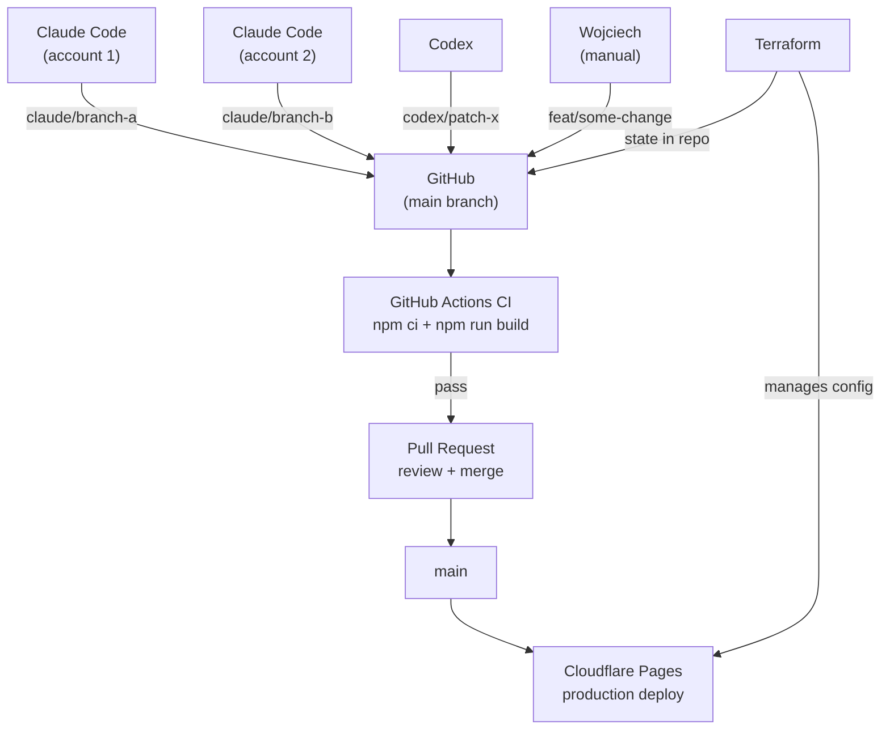

This is the companion case study to [The Claude Code GTM Agent Starter Pack](/insights/how-to-build-gtm-ai-agent-outbound-crm/). That first article breaks down a GTM agent stack. This one breaks down how the portfolio system itself was rebuilt.

The public site is [wojciech.io](https://wojciech.io/). The app-style portfolio surface is [app.wojciech.io](https://app.wojciech.io/). The point of the rebuild was to make both feel like parts of one operating system: public positioning, shipped proof, apps, CV, writing, contact, and future case studies.

The result was not a one-prompt website. It was a structured build process with AI agents, code, review, deployment checks, and a very human taste layer.

---

## Why rebuild it

The portfolio has gone through a few technology eras. Years ago it lived closer to the WordPress world: flexible enough to publish, but heavier than needed for a personal operating surface. Later I moved to Framer, which made sense when the priority was visual speed, polish, and fast iteration.

This rebuild was the next step: from a visual website builder into a code-first, agent-assisted system on Cloudflare Pages.

The previous Framer-era version was useful, but the system had outgrown it.

The new version needed to do more than present a bio:

- show proof through shipped work, not generic services;
- connect the public site with the app portfolio;
- support long-form technical articles;
- make future content and UI changes versioned;
- make deployment and DNS easier to reason about;
- keep the design language consistent across `wojciech.io` and `app.wojciech.io`;
- give agents a codebase they could safely work inside;
- increase what the site could become over time: articles, proof objects, app links, experiments, and agent-assisted iteration.

The main shift was from "website as a page" to "portfolio as an operating surface."

---

## My role in the process

The most important role in this build was not Claude Code or Codex. It was the human decision loop.

My job was to:

- define what the site should become;
- decide what legacy content should be kept, rewritten, redirected, or dropped;
- set the visual direction;
- keep the system close to the app-style portfolio;
- reject generic AI output;
- decide which proof was strong enough to publish;
- review screenshots and call out when a section felt off;
- approve the final deployment direction.

The agents accelerated the work, but they did not own the taste.

That distinction matters. Agentic builds move quickly, but speed only helps if someone keeps the direction tight.

---

## Why code instead of Framer

Framer is strong when the priority is visual composition and fast publishing. For this project, the priority changed.

I needed:

- versioned content;
- MDX articles;
- reusable components;
- predictable redirects;
- sitemap, RSS, robots, canonical URLs, and article schema;
- Git history;
- repeatable builds;
- deploy verification;
- a design system that could be patched by agents without starting from scratch.

At that point, a codebase became the better control plane.

---

## Why Cloudflare instead of Vercel

This was not an anti-Vercel decision. Vercel is a strong platform, especially for Next.js products and server-rendered applications.

For this project, Cloudflare Pages was the cleaner fit:

- the public site is mostly static;
- Astro produces a simple build artifact;
- DNS and custom domain handling were already part of the launch work;
- HTTPS, edge hosting, redirects, and domain verification could sit close together;
- Cloudflare Web Analytics gave enough visibility without adding a heavier analytics stack;
- the app-style portfolio surface also needed simple custom-domain verification.

The decision was pragmatic: use the platform that matches the shape of the site.

For this case, that meant Cloudflare Pages.

---

## The stack

The final stack is deliberately simple:

```text
Astro                       : framework
Tailwind CSS                : styling and design tokens
MDX content collections     : articles and structured content
GitHub                      : source of truth, CI, CODEOWNERS
GitHub Actions              : build validation on every push and PR
Cloudflare Pages            : hosting, branch previews, custom domain
Cloudflare DNS              : DNS, HTTPS, edge performance
Cloudflare Web Analytics    : lightweight analytics
Terraform (CF provider v4)  : infrastructure as code for all CF config
Playwright                  : browser-level verification post-deploy
Claude Code                 : large implementation batches, agent sessions
Codex                       : focused patches, QA, conflict resolution
```

Astro handles the public site and article system. Tailwind and design tokens handle the UI system. GitHub is the source of truth. Cloudflare Pages serves production. Playwright checks what the browser actually renders.

Terraform manages the Cloudflare configuration: Pages project settings, branch deploy rules, custom domain. That is the layer that is easy to skip in a solo project and expensive to reconstruct later.

The AI tools are part of the workflow, not the architecture itself.

---

## How the work was split

The cleanest split was by role, not by tool popularity.

### Claude Code

Claude Code was useful for larger implementation batches:

- foundations;
- page structures;
- components;
- content migration;
- article templates;
- broad page implementation.

It worked best when the task had clear docs and bounded scope.

### Codex

Codex was useful for engineering iteration:

- reading the current repo state;
- making focused patches;
- resolving conflicts;
- running builds;
- checking UI with browser automation;
- verifying production after deployment;
- tightening details after screenshot review.

It worked best as a pragmatic engineering loop.

### Human review

My role was to decide:

- whether the UI felt right;
- whether the copy sounded like me;
- whether a section was too large, too generic, or too disconnected from the rest;
- whether the system was ready to publish.

The agents produced and adjusted. I directed and accepted.

---

## Multi-agent coordination

This project ran with multiple agents working concurrently: Claude Code on two separate accounts, Codex, and occasional manual commits. That combination introduced a coordination problem that a single-developer workflow does not have.

The solution was a coordination layer built from three components:

### Branch naming by source

Every agent writes to its own branch, never directly to `main`.

```text
claude/serene-joliot-904970   ← Claude Code (auto-generated, from either account)
codex/fix-footer-links        ← Codex (short description prefix)
feat/work-page-redesign       ← manual commits from Wojciech
```

Claude Code creates worktrees automatically. Codex is configured to use the `codex/` prefix. This makes the source of every change visible in the branch list without inspecting commits.

### How the agents interact without conflict

The key rule: never two agents on the same branch simultaneously.

In practice:
- Claude Code opens a worktree on a new branch, completes a batch, raises a PR.
- Codex works on a separate branch for QA, patches, or focused changes.
- If both sessions touched the same file, the second merge resolves the conflict in the PR: not locally, and not interactively.



### What keeps it clean between sessions

- Each session ends with a merged or closed branch. No long-lived feature branches.
- After merge, the worktree is removed locally: `git worktree remove`.
- `terraform plan` after any CF dashboard change shows drift before it becomes a problem.

---

## Infrastructure layer

Cloudflare Pages configuration is managed entirely by Terraform, not the dashboard.

This matters for a few reasons that only become obvious after the first time dashboard settings diverge from what you thought was configured.

The Terraform config covers:

```hcl
resource "cloudflare_pages_project" "wojciech_io" {
  name              = "wojciech-io"
  production_branch = "main"

  source {
    config {
      preview_deployment_setting = "custom"
      preview_branch_includes    = ["claude/**"]  # only agent branches get previews
    }
  }

  deployment_configs {
    production {
      environment_variables = {
        PUBLIC_CF_BEACON_TOKEN = "..."
      }
      compatibility_date = "2026-05-10"
      usage_model        = "standard"
      fail_open          = true
    }
  }
}

resource "cloudflare_pages_domain" "wojciech_io_custom" {
  domain = "wojciech.io"
}
```

The pattern is:

```text
terraform plan    ← shows what would change
terraform apply   ← applies it
git commit        ← the config change is now in version history
```

If the CF dashboard drifts: through a manual click, a CF platform update, or a careless change: `terraform plan` shows the diff before it becomes invisible. The state is committed in the repo. The config is reviewable in a PR.

One specific fix this caught: after the first apply, Cloudflare's API silently downgraded `usage_model` from `standard` to `bundled`, reset `compatibility_date` to `2024-01-01`, and flipped `fail_open` to `false`. Without Terraform, those changes would have been invisible. With it, `terraform plan` showed the drift and `terraform apply` restored the correct state in two seconds.

---

## Internationalisation as a system decision

The site ships in three languages: English, Polish, and Italian. The implementation decision was deliberate and worth documenting as a system choice: not just a UI feature.

**The URL vs localStorage problem.** Storing the active language in `localStorage` is quick to implement, but it breaks sharing. If a user sets the language to Polish and shares a link, the recipient sees whatever their `localStorage` says: likely English. URL-based routing solves this: `/pl/` and `/it/` are real routes, shareable and indexable. This matters for SEO and for link sharing through channels where you cannot control the recipient's browser state.

**How the implementation works.** Rather than full Astro i18n with `defineConfig`, each language variant is a thin static wrapper page: `/pl/index.astro`, `/it/index.astro`, each importing the same Layout and components. On the component level, translatable strings are stored as `data-en`, `data-pl`, and `data-it` attributes on HTML elements. A small `setLang()` function reads the active language from the URL path, then swaps `textContent` on every attributed element. No framework routing, no virtual DOM re-render: just a targeted attribute scan on page load.

**Why not `defineConfig` i18n.** For a personal site with five to ten pages, restructuring the content directory into locale subfolders (`/en/`, `/pl/`, `/it/`) would create more overhead than it solves. Thin wrapper pages are easier to maintain and require no Astro version constraints. The tradeoff: this approach does not scale cleanly past fifteen or twenty pages.

**`initialLang` and `define:vars`.** The Layout component accepts an `initialLang` prop. This is injected via Astro's `define:vars` directive so the URL-detected language has priority over any `localStorage` value. This prevents the flash-of-wrong-language on first load of a localised URL.

**SEO.** Each language variant includes `<link rel="alternate" hreflang="...">` tags pointing to the canonical URLs for all three languages. This is the minimum required for Google to correctly associate language variants.

**The size tradeoff.** All three language strings are embedded in the HTML of every page. For landing pages, this is acceptable: the overhead is small and the deployment is simpler. For a content platform with hundreds of articles, this would not be the right architecture.

---

## Security and process hardening

Agentic builds introduce surface area that solo builds do not have. Multiple agents, multiple accounts, and automated pushes mean the repository needs explicit process controls.

### What was put in place

**CODEOWNERS**

```
* @wojciechluszczynski
```

All files in the repo are owned by one person. GitHub routes PR review requests accordingly. Simple, but it means nothing merges to `main` without that owner being in the loop.

**CI on every push and PR**

```yaml
on:
  push:
    branches: ["main", "claude/**"]
  pull_request:
    branches: ["main"]
```

Every agent push triggers a build. If Claude Code or Codex produces a broken Astro build, CI catches it before the PR can proceed. The build artifact from `main` merges is retained for seven days.

**Branch protection**

Branch protection on private GitHub repos requires GitHub Pro. The alternative was a naming convention enforced by habit: agents use their prefix, humans use `feat/` or `fix/`. This is good enough for a project with one human decision-maker. If the repo ever goes public or the team grows, branch protection becomes worth the cost.

**AI crawler access**

Cloudflare's "Block AI bots" setting, if enabled from the dashboard, injects `Disallow` rules for ClaudeBot, GPTBot, Google-Extended, and others into a synthetic robots.txt. That setting was enabled and was silently blocking AI indexing.

The fix was to disable it and switch to "Content Signals Policy": which respects the `robots.txt` in the repo instead of overriding it. The repo's `robots.txt` explicitly allows all crawlers.

That one setting was the reason the site was not visible in AI assistant search results despite ranking fine on Google.

---

## The sprint model

The work ran in batches.

### Sprint 0: Audit and direction

We defined the old-site inventory, what should be migrated, what should be retired, and what the new site needed to prove.

### Sprint 1: Foundation

The first build pass focused on Astro, Tailwind, tokens, layouts, metadata, content collections, and reusable components.

### Sprint 2: Core pages and proof

The site moved from skeleton to actual narrative: homepage, work, AI systems, about, proof cards, testimonials, and app links.

### Sprint 3: Content and launch

The article system, redirects, RSS, sitemap, robots, structured metadata, and launch checks came together.

### Sprint 4: Post-launch hardening

After launch, the work shifted to coherence: app surface, CV, stack, timeline, contact, toggles, footer, light/dark mode, and visual consistency.

That last sprint mattered because this is where a website becomes a system instead of a collection of pages.

---

## Deployment and verification

The deployment flow is intentionally boring:

```text
build
commit
push
deploy
verify production
```

The verification step is the important part.

After deployment, the checks include:

- does the custom domain return the new build?
- does the page return `200`?
- are the expected article and UI markers present?
- does `/insights/` list the right posts?
- does RSS include the new article?
- does desktop and mobile render without horizontal overflow?
- does the theme toggle behave correctly?
- does the contact flow show the intended state?

A deploy preview is useful. The custom domain is the truth.

---

## Testing model

Testing combined three layers.

### Build checks

`npm run build` validates the Astro site, content collections, MDX, routes, RSS, sitemap, and static output.

### Browser checks

Playwright verifies what actually renders:

- desktop layout;
- mobile layout;
- article pages;
- insights listing;
- footer and navigation;
- light/dark toggle;
- contact state;
- overflow.

### Manual review

Manual review catches what automated checks do not:

- visual hierarchy;
- tone;
- rhythm;
- whether a section feels like the same product;
- whether the page is becoming too generic.

That combination worked better than relying on any single tool.

---

## What changed

The rebuild produced a maintainable portfolio system:

- [wojciech.io](https://wojciech.io/) is now a code-first Astro site on Cloudflare Pages;
- [app.wojciech.io](https://app.wojciech.io/) is aligned more closely with the public site;
- Insights are real MDX articles with structured metadata, RSS, sitemap, and canonical URLs;
- infrastructure config (Pages project, branch previews, domain, env vars) is managed by Terraform and version-controlled;
- CI runs on every push from any agent: no broken builds reach `main` undetected;
- CODEOWNERS routes all PR reviews to the right person regardless of which agent opened the PR;
- AI crawlers can access the site: the Cloudflare dashboard setting that was blocking them is disabled;
- multiple agents can work on separate branches concurrently without stepping on each other;
- deployment is repeatable and verifiable at the custom domain level.

The real value is not that AI made a website.

The real value is that the site now has a workflow behind it: and the workflow is also under version control.

---

## What I would reuse

The pattern is simple:

1. Start with the product goal, not the tool.
2. Keep the human in charge of taste, scope, and approval.
3. Give Claude Code large implementation batches.
4. Give Codex review, QA, patching, and deployment verification.
5. Use screenshots, not opinions, to settle UI questions.
6. Keep production verification as part of the workflow.
7. Add Terraform from day one. Dashboard config is invisible drift waiting to happen.
8. Use branch naming conventions to make agent authorship legible at a glance.
9. Turn on CI before you add the second agent. A broken build from an automated session is harder to catch than a broken build from a human.
10. Check crawler access explicitly. CF's "Block AI bots" dashboard toggle is on by default for many accounts and silently disables AI indexing.
11. Remove unnecessary moving parts instead of adding infrastructure for its own sake.

Agentic building does not remove judgment.

It makes judgment more important: and process hygiene matters more, not less, when agents are pushing to your repo.

---

**Related:** [How to Build Micro-SaaS with AI Tools: product lessons from 10+ shipped apps](/insights/how-to-build-micro-saas-with-ai-tools) · [How to Build a GTM AI Agent for Outbound Research and CRM Enrichment](/insights/how-to-build-gtm-ai-agent-outbound-crm)
