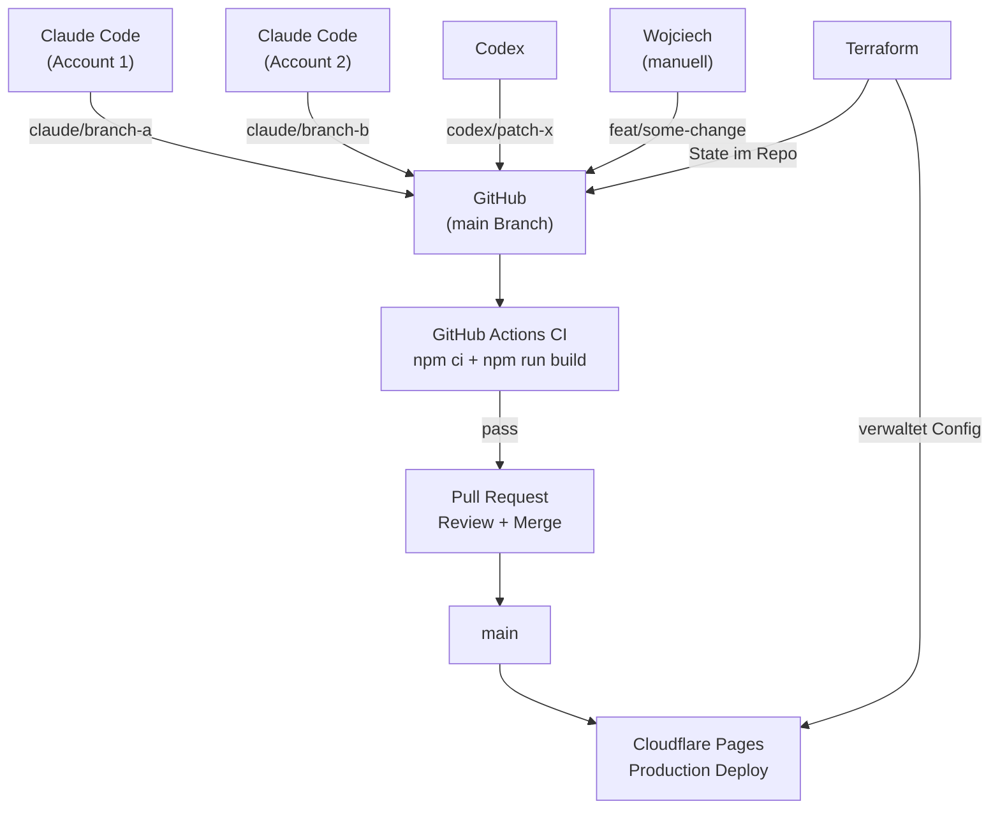

Dies ist die begleitende Fallstudie zu [The Claude Code GTM Agent Starter Pack](/de/insights/how-to-build-gtm-ai-agent-outbound-crm/). Der erste Artikel beschreibt einen GTM Agent Stack. Dieser beschreibt, wie das Portfolio-System selbst neu gebaut wurde.

Die Public Site ist [wojciech.io](https://wojciech.io/). Die App-Oberflaeche ist [app.wojciech.io](https://app.wojciech.io/). Ziel des Rebuilds war, beides wie Teile eines Betriebssystems wirken zu lassen: oeffentliche Positionierung, gelieferte Nachweise, Apps, CV, Artikel, Kontakt und zukuenftige Case Studies.

Das Ergebnis war keine One-Prompt-Website. Es war ein strukturierter Build-Prozess mit AI Agents, Code, Review, Deployment-Checks und einer sehr menschlichen Geschmacksschicht.

---

## Warum der Neuaufbau

Das Portfolio hat mehrere Technologie-Epochen durchlaufen. Vor Jahren lag es naeher an der WordPress-Welt: flexibel genug zum Publizieren, aber schwerer als noetig fuer eine persoenliche Arbeitsoberflaeche. Spaeter bin ich zu Framer gewechselt, was Sinn machte, als die Prioritaet auf visueller Geschwindigkeit, Polish und schneller Iteration lag.

Dieser Rebuild war der naechste Schritt: von einem visuellen Website-Builder zu einem code-first, agent-gestuetzten System auf Cloudflare Pages.

Die vorherige Framer-Version war nuetzlich, aber das System war ihr entwachsen.

Die neue Version musste mehr koennen als eine Bio praesentieren:

<TwoUp
  left={{ title: 'Vorher (Framer-Aera)', items: ['Visueller Builder, schnelle Iteration', 'Keine Versionierung, keine Git History', 'Begrenztes MDX, keine Content Collections', 'Eine Oberflaeche, schwer erweiterbar'] }}
  right={{ title: 'Nachher (Astro + CF)', items: ['Code-first, agent-editierbar', 'Volle Git History, Branch Previews', 'MDX Artikel, 44 Custom Components', 'Sieben Oberflaechen, ein Betriebssystem'] }}
/>

Der Hauptwechsel war von "Website als Seite" zu "Portfolio als Arbeitsoberflaeche."

---

## Meine Rolle im Prozess

Die wichtigste Rolle in diesem Build war nicht Claude Code oder Codex. Es war der menschliche Entscheidungsloop.

Mein Job war:

- definieren, was die Site werden soll;
- entscheiden, welcher Legacy Content behalten, umgeschrieben, umgeleitet oder entfernt wird;
- die visuelle Richtung vorgeben;
- das System nah am App-Portfolio halten;
- generischen AI Output ablehnen;
- entscheiden, welche Nachweise stark genug zum Veroeffentlichen sind;
- Screenshots reviewen und sagen, wenn ein Abschnitt nicht stimmte;
- die finale Deployment-Richtung freigeben.

Die Agents haben die Arbeit beschleunigt, aber den Geschmack hatten sie nicht.

Diese Unterscheidung ist wichtig. Agentische Builds sind schnell, aber Geschwindigkeit hilft nur, wenn jemand die Richtung straff haelt.

---

## Warum Code statt Framer

Framer ist stark, wenn die Prioritaet auf visueller Komposition und schnellem Publizieren liegt. Bei diesem Projekt hatte sich die Prioritaet verschoben.

Ich brauchte:

- versionierte Inhalte;
- MDX Artikel;
- wiederverwendbare Components;
- vorhersagbare Redirects;
- Sitemap, RSS, robots, kanonische URLs und Artikel-Schema;
- Git History;
- wiederholbare Builds;
- Deploy-Verifizierung;
- ein Design System, das von Agents gepatcht werden kann, ohne von vorne anzufangen.

An diesem Punkt wurde eine Codebase zum besseren Control Plane.

---

## Warum Cloudflare statt Vercel

Das war keine Anti-Vercel-Entscheidung. Vercel ist eine starke Plattform, besonders fuer Next.js Produkte und server-gerenderte Anwendungen.

Fuer dieses Projekt passte Cloudflare Pages besser:

- die Public Site ist groesstenteils statisch;
- Astro produziert ein einfaches Build-Artefakt;
- DNS und Custom-Domain-Handling waren bereits Teil der Launch-Arbeit;
- HTTPS, Edge-Hosting, Redirects und Domain-Verifizierung konnten zusammenliegen;
- Cloudflare Web Analytics reichte als Sichtbarkeit ohne schwereres Analytics-Stack;
- die App-Oberflaeche brauchte ebenfalls einfache Custom-Domain-Verifizierung.

Die Entscheidung war pragmatisch: die Plattform nutzen, die zur Form der Site passt.

<Callout type="tip" title="Das Konsolidierungsargument">
Wenn DNS, CDN, WAF, Hosting und Deploy-Verifizierung auf derselben Plattform liegen, ist die Betriebsflaeche ein Dashboard und eine API. Den vollstaendigen [Security und Identity Stack auf Cloudflare](/de/insights/cloudflare-migration-zero-trust-free-tier/) habe ich separat beschrieben.
</Callout>

---

## Der Stack

Der finale Stack ist bewusst einfach:

```text
Astro                       : Framework
Tailwind CSS                : Styling und Design Tokens
MDX Content Collections     : Artikel und strukturierte Inhalte
GitHub                      : Source of Truth, CI, CODEOWNERS
GitHub Actions              : Build-Validierung bei jedem Push und PR
Cloudflare Pages            : Hosting, Branch Previews, Custom Domain
Cloudflare DNS              : DNS, HTTPS, Edge Performance
Cloudflare Web Analytics    : Lightweight Analytics
Terraform (CF Provider v4)  : Infrastructure as Code fuer alle CF Config
Playwright                  : Browser-Level-Verifizierung nach Deploy
Claude Code                 : Grosse Implementierungsbatches, Agent Sessions
Codex                       : Fokussierte Patches, QA, Konfliktloesung
```

Astro uebernimmt Public Site und Artikelsystem. Tailwind und Design Tokens das UI System. GitHub ist Source of Truth. Cloudflare Pages dient die Produktion. Playwright prueft, was der Browser tatsaechlich rendert.

Terraform verwaltet die Cloudflare-Konfiguration: Pages-Projekteinstellungen, Branch-Deploy-Regeln, Custom Domain. Das ist die Schicht, die bei Solo-Projekten gerne uebersprungen wird und spaeter teuer nachzuholen ist.

Die AI Tools sind Teil des Workflows, nicht der Architektur selbst.

---

## Wie die Arbeit aufgeteilt wurde

Die sauberste Aufteilung war nach Rolle, nicht nach Tool-Popularitaet.

<Tabs labels={['Claude Code', 'Codex', 'Human Review']}>
  <Fragment slot="0">Groessere Implementierungsbatches: Fundamente, Seitenstrukturen, Components, Content-Migration, Artikelvorlagen, breite Seitenimplementierung. Funktionierte am besten, wenn die Aufgabe klare Docs und begrenzten Scope hatte.</Fragment>
  <Fragment slot="1">Engineering-Iteration: aktuellen Repo-Stand lesen, fokussierte Patches machen, Konflikte loesen, Builds laufen lassen, UI per Browser-Automation pruefen, Produktion nach Deployment verifizieren, Details nach Screenshot-Review verfeinern.</Fragment>
  <Fragment slot="2">Entscheiden, ob die UI sich richtig anfuehlt, ob der Text nach mir klingt, ob ein Abschnitt zu gross oder zu generisch ist, und ob das System bereit zur Veroeffentlichung war. Die Agents haben produziert und angepasst. Ich habe gesteuert und freigegeben.</Fragment>
</Tabs>

---

## Multi-Agent-Koordination

Dieses Projekt lief mit mehreren Agents gleichzeitig: Claude Code auf zwei separaten Accounts, Codex und gelegentliche manuelle Commits. Diese Kombination brachte ein Koordinationsproblem, das ein Einzelentwickler-Workflow nicht hat.

Die Loesung war ein Koordinationsmodell aus drei Komponenten:

### Branch-Benennung nach Quelle

Jeder Agent schreibt auf seinen eigenen Branch, nie direkt auf `main`.

```text
claude/serene-joliot-904970   ← Claude Code (auto-generiert, von beiden Accounts)
codex/fix-footer-links        ← Codex (kurzer Beschreibungs-Prefix)
feat/work-page-redesign       ← manuelle Commits von Wojciech
```

Claude Code erstellt Worktrees automatisch. Codex ist mit dem `codex/`-Prefix konfiguriert. Das macht die Quelle jeder Aenderung in der Branch-Liste sichtbar, ohne Commits inspizieren zu muessen.

### Wie die Agents ohne Konflikte interagieren

Die Schluesselregel: nie zwei Agents gleichzeitig auf demselben Branch.

In der Praxis:
- Claude Code oeffnet einen Worktree auf einem neuen Branch, erledigt einen Batch, erstellt einen PR.
- Codex arbeitet auf einem separaten Branch fuer QA, Patches oder fokussierte Aenderungen.
- Wenn beide Sessions dieselbe Datei beruehrt haben, loest der zweite Merge den Konflikt im PR: nicht lokal und nicht interaktiv.



### Was zwischen Sessions sauber haelt

- Jede Session endet mit einem gemergten oder geschlossenen Branch. Keine langlebigen Feature-Branches.
- Nach dem Merge wird der Worktree lokal entfernt: `git worktree remove`.
- `terraform plan` nach jeder CF-Dashboard-Aenderung zeigt Drift, bevor er zum Problem wird.

---

## Infrastruktur-Layer

Die Cloudflare-Pages-Konfiguration wird vollstaendig per Terraform verwaltet, nicht ueber das Dashboard.

Das ist aus ein paar Gruenden wichtig, die erst offensichtlich werden, nachdem Dashboard-Einstellungen zum ersten Mal von dem abweichen, was man konfiguriert zu haben glaubte.

Die Terraform-Config umfasst:

```hcl
resource "cloudflare_pages_project" "wojciech_io" {
  name              = "wojciech-io"
  production_branch = "main"

  source {
    config {
      preview_deployment_setting = "custom"
      preview_branch_includes    = ["claude/**"]  # nur Agent-Branches bekommen Previews
    }
  }

  deployment_configs {
    production {
      environment_variables = {
        PUBLIC_CF_BEACON_TOKEN = "..."
      }
      compatibility_date = "2026-05-10"
      usage_model        = "standard"
      fail_open          = true
    }
  }
}

resource "cloudflare_pages_domain" "wojciech_io_custom" {
  domain = "wojciech.io"
}
```

Das Muster ist:

```text
terraform plan    ← zeigt, was sich aendern wuerde
terraform apply   ← wendet es an
git commit        ← die Config-Aenderung ist jetzt in der Versionshistorie
```

Wenn das CF Dashboard driftet: durch einen manuellen Klick, ein CF-Plattform-Update oder eine unvorsichtige Aenderung: zeigt `terraform plan` den Diff, bevor er unsichtbar wird. Der State ist im Repo committed. Die Config ist in einem PR reviewbar.

Ein konkreter Fix, den das aufgedeckt hat: nach dem ersten Apply hat Cloudflares API stillschweigend `usage_model` von `standard` auf `bundled` herabgestuft, `compatibility_date` auf `2024-01-01` zurueckgesetzt und `fail_open` auf `false` umgestellt. Ohne Terraform waeren diese Aenderungen unsichtbar gewesen. Mit Terraform hat `terraform plan` den Drift gezeigt und `terraform apply` den korrekten Zustand in zwei Sekunden wiederhergestellt.

---

## Internationalisierung als Systementscheidung

Die Site wird in drei Sprachen ausgeliefert: Englisch, Polnisch und Italienisch. Die Implementierungsentscheidung war bewusst und verdient Dokumentation als Systementscheidung: nicht nur als UI-Feature.

**Das URL- vs. localStorage-Problem.** Die aktive Sprache in `localStorage` zu speichern ist schnell implementiert, aber bricht das Teilen. Wenn ein Nutzer die Sprache auf Polnisch stellt und einen Link teilt, sieht der Empfaenger, was sein `localStorage` sagt: wahrscheinlich Englisch. URL-basiertes Routing loest das: `/pl/` und `/it/` sind echte Routen, teilbar und indexierbar. Das ist wichtig fuer SEO und fuer Link-Sharing ueber Kanaele, bei denen man den Browser-Zustand des Empfaengers nicht kontrollieren kann.

**Wie die Implementierung funktioniert.** Statt vollem Astro i18n mit `defineConfig` ist jede Sprachvariante eine duenne statische Wrapper-Seite: `/pl/index.astro`, `/it/index.astro`, jeweils das gleiche Layout und die gleichen Components importierend. Auf Component-Ebene werden uebersetzbare Strings als `data-en`, `data-pl` und `data-it` Attribute auf HTML-Elementen gespeichert. Eine kleine `setLang()`-Funktion liest die aktive Sprache aus dem URL-Pfad und tauscht dann `textContent` auf jedem attributierten Element. Kein Framework-Routing, kein Virtual-DOM-Re-Render: nur ein gezielter Attribut-Scan beim Seitenaufruf.

**Warum nicht `defineConfig` i18n.** Fuer eine persoenliche Site mit fuenf bis zehn Seiten wuerde die Umstrukturierung des Content-Verzeichnisses in Locale-Unterordner (`/en/`, `/pl/`, `/it/`) mehr Overhead erzeugen als loesen. Duenne Wrapper-Seiten sind einfacher zu warten und erfordern keine Astro-Versionsabhaengigkeiten. Der Tradeoff: dieser Ansatz skaliert nicht sauber ueber fuenfzehn oder zwanzig Seiten hinaus.

**`initialLang` und `define:vars`.** Die Layout-Komponente akzeptiert ein `initialLang`-Prop. Es wird ueber Astros `define:vars`-Direktive injiziert, damit die URL-erkannte Sprache Vorrang vor jedem `localStorage`-Wert hat. Das verhindert den Flash-of-Wrong-Language beim ersten Laden einer lokalisierten URL.

**SEO.** Jede Sprachvariante enthaelt `<link rel="alternate" hreflang="...">` Tags, die auf die kanonischen URLs aller drei Sprachen zeigen. Das ist das Minimum, damit Google Sprachvarianten korrekt zuordnet.

**Der Groessen-Tradeoff.** Alle drei Sprachstrings sind im HTML jeder Seite eingebettet. Fuer Landing Pages ist das akzeptabel: der Overhead ist klein und das Deployment einfacher. Fuer eine Content-Plattform mit Hunderten von Artikeln waere das nicht die richtige Architektur.

---

## Sicherheit und Prozesshaertung

Agentische Builds bringen Angriffsflaeche mit, die Solo-Builds nicht haben. Mehrere Agents, mehrere Accounts und automatisierte Pushes bedeuten, dass das Repository explizite Prozesskontrollen braucht.

### Was eingerichtet wurde

**CODEOWNERS**

```
* @wojciechluszczynski
```

Alle Dateien im Repo gehoeren einer Person. GitHub routet PR-Review-Requests entsprechend. Einfach, aber es bedeutet: nichts wird in `main` gemergt, ohne dass der Owner im Loop ist.

**CI bei jedem Push und PR**

```yaml
on:
  push:
    branches: ["main", "claude/**"]
  pull_request:
    branches: ["main"]
```

Jeder Agent-Push loest einen Build aus. Wenn Claude Code oder Codex einen kaputten Astro-Build produziert, faengt CI das ab, bevor der PR weitergehen kann. Das Build-Artefakt von `main`-Merges wird sieben Tage aufbewahrt.

**Branch Protection**

Branch Protection bei privaten GitHub-Repos erfordert GitHub Pro. Die Alternative war eine Namenskonvention, die per Gewohnheit durchgesetzt wird: Agents nutzen ihren Prefix, Menschen nutzen `feat/` oder `fix/`. Das reicht fuer ein Projekt mit einem menschlichen Entscheider. Wenn das Repo jemals oeffentlich wird oder das Team waechst, lohnt sich Branch Protection.

**AI Crawler-Zugang**

Cloudflares "Block AI bots"-Einstellung injiziert, wenn aktiviert, `Disallow`-Regeln fuer ClaudeBot, GPTBot, Google-Extended und andere in eine synthetische robots.txt. Diese Einstellung war aktiv und hat AI-Indexierung stillschweigend blockiert.

Der Fix war, sie zu deaktivieren und auf "Content Signals Policy" umzuschalten: die die `robots.txt` im Repo respektiert statt sie zu ueberschreiben. Die `robots.txt` des Repos erlaubt explizit alle Crawler.

Diese eine Einstellung war der Grund, warum die Site in AI-Assistenten-Suchergebnissen nicht sichtbar war, obwohl sie bei Google gut rankte.

<Callout type="warning" title="CF Dashboard-Falle">
Cloudflares "Block AI bots" ist bei vielen Accounts standardmaessig an. Es injiziert stillschweigend Disallow-Regeln, die AI-Indexierung verhindern. Wechsle zu "Content Signals Policy" und steuere den Zugang ueber deine eigene robots.txt.
</Callout>

---

## Das Sprint-Modell

Die Arbeit lief in Batches.

<Steps items={[
  { title: "Sprint 0: Audit und Richtung", body: "Inventar der alten Site, Migrationsentscheidungen, was ausrangiert wird, was die neue Site beweisen muss." },
  { title: "Sprint 1: Fundament", body: "Astro, Tailwind, Tokens, Layouts, Metadata, Content Collections, wiederverwendbare Components." },
  { title: "Sprint 2: Kernseiten und Nachweise", body: "Homepage, Work, AI Systems, About, Proof Cards, Testimonials, App-Links. Vom Skelett zum Narrativ." },
  { title: "Sprint 3: Content und Launch", body: "Artikelsystem, Redirects, RSS, Sitemap, Robots, strukturierte Metadata, Launch-Checks." },
  { title: "Sprint 4: Post-Launch-Haertung", body: "App-Oberflaeche, CV, Stack, Timeline, Kontakt, Toggles, Footer, Light/Dark Mode, visuelle Konsistenz." },
]} />

Der letzte Sprint war entscheidend, denn hier wird eine Website zu einem System statt einer Seitensammlung.

---

## Deployment und Verifizierung

Der Deployment-Flow ist bewusst langweilig:

```text
build
commit
push
deploy
Produktion verifizieren
```

Der Verifizierungsschritt ist der wichtige Teil.

Nach dem Deployment umfassen die Checks:

- gibt die Custom Domain den neuen Build zurueck?
- gibt die Seite `200` zurueck?
- sind die erwarteten Artikel- und UI-Marker vorhanden?
- listet `/insights/` die richtigen Posts?
- enthaelt RSS den neuen Artikel?
- rendert Desktop und Mobile ohne horizontalen Overflow?
- verhaelt sich der Theme Toggle korrekt?
- zeigt der Kontaktfluss den beabsichtigten Zustand?

Ein Deploy Preview ist nuetzlich. Die Custom Domain ist die Wahrheit.

---

## Testing-Modell

Testing kombinierte drei Ebenen.

### Build-Checks

`npm run build` validiert die Astro-Site, Content Collections, MDX, Routes, RSS, Sitemap und statischen Output.

### Browser-Checks

Playwright verifiziert, was tatsaechlich gerendert wird:

- Desktop-Layout;
- Mobile-Layout;
- Artikelseiten;
- Insights-Listing;
- Footer und Navigation;
- Light/Dark Toggle;
- Kontaktzustand;
- Overflow.

### Manuelles Review

Manuelles Review faengt auf, was automatisierte Checks nicht koennen:

- visuelle Hierarchie;
- Tonalitaet;
- Rhythmus;
- ob ein Abschnitt sich wie das gleiche Produkt anfuehlt;
- ob die Seite zu generisch wird.

Diese Kombination funktionierte besser als sich auf ein einzelnes Tool zu verlassen.

---

## Was sich geaendert hat

Der Rebuild hat ein wartbares Portfolio-System produziert:

- [wojciech.io](https://wojciech.io/) ist jetzt eine code-first Astro-Site auf Cloudflare Pages;
- [app.wojciech.io](https://app.wojciech.io/) ist naeher an die Public Site angeglichen;
- Insights sind echte MDX-Artikel mit strukturierter Metadata, RSS, Sitemap und kanonischen URLs;
- Infrastruktur-Config (Pages-Projekt, Branch Previews, Domain, Env Vars) wird per Terraform verwaltet und versionskontrolliert;
- CI laeuft bei jedem Push von jedem Agent: kein kaputter Build erreicht `main` unbemerkt;
- CODEOWNERS routet alle PR Reviews an die richtige Person, unabhaengig davon, welcher Agent den PR geoeffnet hat;
- AI Crawler koennen auf die Site zugreifen: die Cloudflare-Dashboard-Einstellung, die sie blockiert hat, ist deaktiviert;
- mehrere Agents koennen auf separaten Branches gleichzeitig arbeiten, ohne sich in die Quere zu kommen;
- Deployment ist wiederholbar und auf Custom-Domain-Ebene verifizierbar.

Der echte Wert ist nicht, dass AI eine Website gebaut hat.

Der echte Wert ist, dass die Site jetzt einen Workflow hinter sich hat: und der Workflow ist ebenfalls versionskontrolliert.

---

## Was ich wiederverwenden wuerde

Das Muster ist einfach:

1. Mit dem Produktziel starten, nicht mit dem Tool.
2. Den Menschen fuer Geschmack, Scope und Freigabe verantwortlich halten.
3. Claude Code grosse Implementierungsbatches geben.
4. Codex Review, QA, Patching und Deployment-Verifizierung geben.
5. Screenshots statt Meinungen fuer UI-Fragen nutzen.
6. Produktionsverifizierung als Teil des Workflows beibehalten.
7. Terraform ab Tag eins einsetzen. Dashboard-Config ist unsichtbarer Drift, der nur darauf wartet zu passieren.
8. Branch-Namenskonventionen nutzen, um Agent-Autorschaft auf einen Blick lesbar zu machen.
9. CI einschalten, bevor der zweite Agent dazukommt. Ein kaputter Build aus einer automatisierten Session ist schwerer zu finden als einer von einem Menschen.
10. Crawler-Zugang explizit pruefen. Cloudflares "Block AI bots"-Toggle im Dashboard ist bei vielen Accounts standardmaessig an und deaktiviert AI-Indexierung stillschweigend.
11. Unnoetige bewegliche Teile entfernen statt Infrastruktur um ihrer selbst willen hinzuzufuegen.

Agentisches Bauen entfernt kein Urteilsvermoegen.

Es macht Urteilsvermoegen wichtiger: und Prozesshygiene zaehlt mehr, nicht weniger, wenn Agents in dein Repo pushen.

---

**Verwandt:** [How to Build Micro-SaaS with AI Tools: product lessons from 10+ shipped apps](/de/insights/how-to-build-micro-saas-with-ai-tools) · [How to Build a GTM AI Agent for Outbound Research and CRM Enrichment](/de/insights/how-to-build-gtm-ai-agent-outbound-crm)
