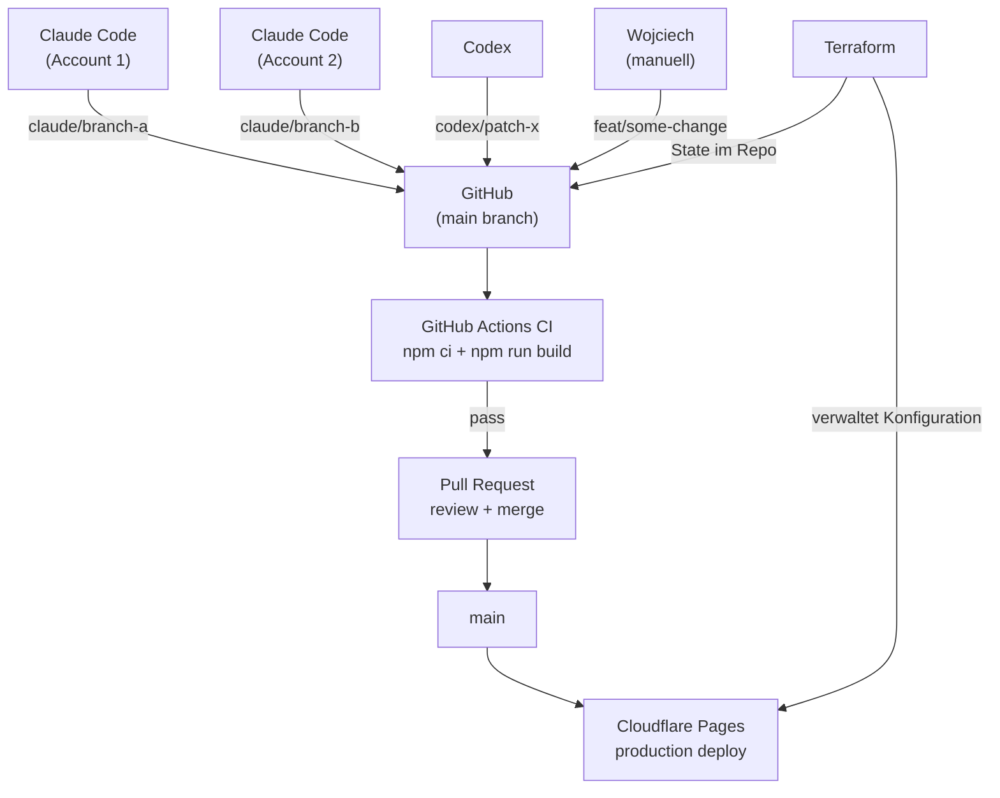

Dieser Artikel ist das Begleit-Case-Study zu [The Claude Code GTM Agent Starter Pack](/insights/how-to-build-gtm-ai-agent-outbound-crm/). Der erste Artikel beschreibt einen GTM-Agent-Stack. Dieser erklärt, wie das Portfolio-System selbst neu aufgebaut wurde.

Die öffentliche Seite ist [wojciech.io](https://wojciech.io/). Die App-artige Portfolio-Oberfläche ist [app.wojciech.io](https://app.wojciech.io/). Der Sinn des Rebuilds war, beide als Teile eines Operating System erscheinen zu lassen: öffentliches Positioning, gelieferter Proof, Apps, CV, Texte, Kontakt und zukünftige Case Studies.

Das Ergebnis war keine One-Prompt-Website. Es war ein strukturierter Bauprozess mit AI-Agents, Code, Reviews, Deployment-Prüfungen und einer sehr menschlichen Geschmacksebene.

---

## Warum neu bauen

Das Portfolio hat mehrere Technologie-Ären durchlaufen. Vor Jahren lebte es näher an der WordPress-Welt: flexibel genug zum Publizieren, aber zu schwer für eine persönliche Operating Surface. Später wechselte ich zu Framer, was Sinn machte, als die Priorität bei visueller Geschwindigkeit, Polish und schneller Iteration lag.

Dieser Rebuild war der nächste Schritt: von einem visuellen Website-Builder zu einem code-first, agent-unterstützten System auf Cloudflare Pages.

Die frühere Framer-Version war nützlich, aber das System war ihr entwachsen.

Die neue Version musste mehr leisten als eine Biografie zu präsentieren:

- Proof durch gelieferte Arbeiten zeigen, nicht generische Services;
- die öffentliche Seite mit dem App-Portfolio verbinden;
- technische Longarticles unterstützen;
- zukünftige Content- und UI-Änderungen versionieren;
- Deployment und DNS einfacher handhabbar machen;
- die Design-Sprache konsistent über `wojciech.io` und `app.wojciech.io` halten;
- Agents eine Codebasis geben, in der sie sicher arbeiten können;
- das Potenzial der Seite langfristig steigern: Artikel, Proof-Objekte, App-Links, Experimente und agent-unterstützte Iteration.

Der Hauptwechsel war von "Website als Seite" zu "Portfolio als Operating Surface".

---

## Meine Rolle im Prozess

Die wichtigste Rolle in diesem Build war nicht Claude Code oder Codex. Es war die menschliche Entscheidungsschleife.

Meine Aufgabe war es:

- zu definieren, was die Seite werden soll;
- zu entscheiden, welcher Legacy-Content beibehalten, umgeschrieben, umgeleitet oder entfernt werden soll;
- die visuelle Richtung vorzugeben;
- das System nah am App-artigen Portfolio zu halten;
- generischen AI-Output abzulehnen;
- zu entscheiden, welcher Proof stark genug ist zum Veröffentlichen;
- Screenshots zu prüfen und zu beanstanden, wenn ein Abschnitt sich falsch anfühlte;
- die finale Deployment-Richtung freizugeben.

Die Agents haben die Arbeit beschleunigt, aber sie besaßen nicht den Geschmack.

Diese Unterscheidung ist wichtig. Agentische Builds laufen schnell, aber Geschwindigkeit hilft nur, wenn jemand die Richtung eng hält.

---

## Warum Code statt Framer

Framer ist stark, wenn die Priorität auf visueller Komposition und schnellem Publizieren liegt. Für dieses Projekt änderten sich die Prioritäten.

Ich brauchte:

- versionierten Content;
- MDX-Artikel;
- wiederverwendbare Komponenten;
- vorhersagbare Redirects;
- Sitemap, RSS, robots, kanonische URLs und Article-Schema;
- Git-History;
- wiederholbare Builds;
- Deployment-Verifikation;
- ein Design-System, das Agents patchen können ohne von vorne anzufangen.

Zu diesem Zeitpunkt wurde eine Codebasis zur besseren Control-Plane.

---

## Warum Cloudflare statt Vercel

Das war keine Anti-Vercel-Entscheidung. Vercel ist eine starke Plattform, besonders für Next.js-Produkte und server-seitig gerenderte Applikationen.

Für dieses Projekt war Cloudflare Pages die sauberere Wahl:

- die öffentliche Seite ist größtenteils statisch;
- Astro produziert ein einfaches Build-Artefakt;
- DNS und Custom-Domain-Handling waren bereits Teil der Launch-Arbeit;
- HTTPS, Edge-Hosting, Redirects und Domain-Verifikation konnten eng zusammenliegen;
- Cloudflare Web Analytics gab ausreichend Sichtbarkeit ohne einen schwereren Analytics-Stack hinzuzufügen;
- die App-artige Portfolio-Oberfläche brauchte ebenfalls einfache Custom-Domain-Verifikation.

Die Entscheidung war pragmatisch: die Plattform nutzen, die zur Form der Seite passt.

In diesem Fall bedeutete das Cloudflare Pages.

---

## Der Stack

Der finale Stack ist bewusst einfach gehalten:

```text
Astro                       : Framework
Tailwind CSS                : Styling und Design-Tokens
MDX content collections     : Artikel und strukturierter Content
GitHub                      : Source of Truth, CI, CODEOWNERS
GitHub Actions              : Build-Validierung bei jedem Push und PR
Cloudflare Pages            : Hosting, Branch-Previews, Custom-Domain
Cloudflare DNS              : DNS, HTTPS, Edge-Performance
Cloudflare Web Analytics    : Leichte Analytics
Terraform (CF provider v4)  : Infrastructure as Code für alle CF-Konfiguration
Playwright                  : Browser-Level-Verifikation nach Deployment
Claude Code                 : Große Implementierungsbatches, Agent-Sessions
Codex                       : Gezielte Patches, QA, Konfliktlösung
```

Astro verwaltet die öffentliche Seite und das Artikelsystem. Tailwind und Design-Tokens verwalten das UI-System. GitHub ist die Source of Truth. Cloudflare Pages bedient die Produktion. Playwright prüft, was der Browser tatsächlich rendert.

Terraform verwaltet die Cloudflare-Konfiguration: Pages-Projekteinstellungen, Branch-Deploy-Regeln, Custom-Domain. Das ist die Schicht, die man in einem Solo-Projekt leicht überspringt und die später teuer zu rekonstruieren ist.

Die AI-Tools sind Teil des Workflows, nicht der Architektur selbst.

---

## Wie die Arbeit aufgeteilt war

Die sauberste Aufteilung war nach Rolle, nicht nach Tool-Popularität.

### Claude Code

Claude Code war nützlich für größere Implementierungsbatches:

- Fundamente;
- Seitenstrukturen;
- Komponenten;
- Content-Migration;
- Artikel-Templates;
- breite Seitenimplementierung.

Es funktionierte am besten, wenn die Aufgabe klare Dokumentation und begrenzten Scope hatte.

### Codex

Codex war nützlich für Engineering-Iteration:

- den aktuellen Repo-Stand lesen;
- gezielte Patches erstellen;
- Konflikte lösen;
- Builds ausführen;
- UI mit Browser-Automatisierung prüfen;
- Produktion nach Deployment verifizieren;
- Details nach Screenshot-Review verfeinern.

Es funktionierte am besten als pragmatische Engineering-Schleife.

### Menschliche Review

Meine Aufgabe war zu entscheiden:

- ob das UI sich richtig anfühlte;
- ob der Text klingt wie ich;
- ob ein Abschnitt zu groß, zu generisch oder zu abgekoppelt vom Rest war;
- ob das System bereit war zum Veröffentlichen.

Die Agents produzierten und passten an. Ich steuerte und akzeptierte.

---

## Multi-Agent-Koordination

Dieses Projekt lief mit mehreren parallel arbeitenden Agents: Claude Code auf zwei getrennten Accounts, Codex und gelegentliche manuelle Commits. Diese Kombination führt zu einem Koordinationsproblem, das ein Single-Developer-Workflow nicht hat.

Die Lösung war eine Koordinationsschicht aus drei Komponenten:

### Branch-Benennung nach Quelle

Jeder Agent schreibt in seinen eigenen Branch, niemals direkt in `main`.

```text
claude/serene-joliot-904970   ← Claude Code (auto-generiert, von beiden Accounts)
codex/fix-footer-links        ← Codex (kurzes Beschreibungspräfix)
feat/work-page-redesign       ← manuelle Commits von Wojciech
```

Claude Code erstellt Worktrees automatisch. Codex ist konfiguriert, das `codex/`-Präfix zu verwenden. Das macht die Quelle jeder Änderung in der Branch-Liste sichtbar, ohne Commits zu prüfen.

### Wie Agents ohne Konflikt interagieren

Die Hauptregel: niemals zwei Agents gleichzeitig auf demselben Branch.

In der Praxis:
- Claude Code öffnet einen Worktree auf einem neuen Branch, schließt einen Batch ab, öffnet einen PR.
- Codex arbeitet auf einem separaten Branch für QA, Patches oder gezielte Änderungen.
- Wenn beide Sessions dieselbe Datei berührt haben, löst der zweite Merge den Konflikt im PR: nicht lokal und nicht interaktiv.



### Was zwischen Sessions Ordnung hält

- Jede Session endet mit einem gemergten oder geschlossenen Branch. Keine langlebigen Feature-Branches.
- Nach dem Merge wird der Worktree lokal entfernt: `git worktree remove`.
- `terraform plan` nach jeder CF-Dashboard-Änderung zeigt Drift, bevor er zum Problem wird.

---

## Infrastructure-Schicht

Die Cloudflare-Pages-Konfiguration wird vollständig durch Terraform verwaltet, nicht das Dashboard.

Das hat mehrere Gründe, die erst offensichtlich werden, nachdem Dashboard-Einstellungen zum ersten Mal von dem abweichen, was man zu haben glaubte.

Die Terraform-Konfiguration umfasst:

```hcl
resource "cloudflare_pages_project" "wojciech_io" {
  name              = "wojciech-io"
  production_branch = "main"

  source {
    config {
      preview_deployment_setting = "custom"
      preview_branch_includes    = ["claude/**"]  # nur Agent-Branches bekommen Previews
    }
  }

  deployment_configs {
    production {
      environment_variables = {
        PUBLIC_CF_BEACON_TOKEN = "..."
      }
      compatibility_date = "2026-05-10"
      usage_model        = "standard"
      fail_open          = true
    }
  }
}

resource "cloudflare_pages_domain" "wojciech_io_custom" {
  domain = "wojciech.io"
}
```

Das Muster ist:

```text
terraform plan    ← zeigt, was sich ändern würde
terraform apply   ← wendet es an
git commit        ← die Konfigurationsänderung ist jetzt in der Versionshistorie
```

Wenn das CF-Dashboard driftet: durch einen manuellen Klick, ein CF-Plattform-Update oder eine unachtsame Änderung: zeigt `terraform plan` den Diff, bevor er unsichtbar wird. Der State ist im Repo committet. Die Konfiguration ist in einem PR reviewbar.

Ein konkreter Fix, den das abgefangen hat: Nach dem ersten Apply stufte Cloudflares API `usage_model` still von `standard` auf `bundled` herab, setzte `compatibility_date` auf `2024-01-01` zurück und kippte `fail_open` auf `false`. Ohne Terraform wären diese Änderungen unsichtbar geblieben. Damit zeigte `terraform plan` den Drift und `terraform apply` stellte den korrekten Zustand in zwei Sekunden wieder her.

---

## Internationalisierung als Systementscheidung

Die Seite ist in drei Sprachen verfügbar: Englisch, Polnisch und Italienisch. Die Implementierungsentscheidung war bewusst und es lohnt sich, sie als Systementscheidung zu dokumentieren: nicht nur als UI-Feature.

**Das URL-vs-localStorage-Problem.** Die aktive Sprache in `localStorage` zu speichern ist schnell implementiert, aber es bricht das Teilen. Wenn ein Nutzer die Sprache auf Polnisch setzt und einen Link teilt, sieht der Empfänger, was sein `localStorage` sagt: wahrscheinlich Englisch. URL-basiertes Routing löst das: `/pl/` und `/it/` sind echte Routen, teilbar und indexierbar. Das ist relevant für SEO und das Teilen von Links über Kanäle, wo man den Browser-State des Empfängers nicht kontrollieren kann.

**Wie die Implementierung funktioniert.** Anstelle von vollem Astro i18n mit `defineConfig` ist jede Sprachvariante eine dünne statische Wrapper-Seite: `/pl/index.astro`, `/it/index.astro`, jede importiert dasselbe Layout und dieselben Komponenten. Auf Komponentenebene werden übersetzbare Strings als `data-en`-, `data-pl`- und `data-it`-Attribute auf HTML-Elementen gespeichert. Eine kleine `setLang()`-Funktion liest die aktive Sprache aus dem URL-Pfad und tauscht dann `textContent` bei jedem attributierten Element aus. Kein Framework-Routing, kein Virtual-DOM-Re-Render: nur ein gezielter Attribute-Scan beim Seitenladen.

**Warum nicht `defineConfig` i18n.** Für eine persönliche Seite mit fünf bis zehn Seiten würde eine Umstrukturierung des Content-Verzeichnisses in Locale-Unterordner (`/en/`, `/pl/`, `/it/`) mehr Overhead erzeugen als lösen. Dünne Wrapper-Seiten sind einfacher zu warten und erfordern keine Astro-Versionsbeschränkungen. Der Kompromiss: Dieser Ansatz skaliert über fünfzehn oder zwanzig Seiten hinaus nicht sauber.

**`initialLang` und `define:vars`.** Die Layout-Komponente akzeptiert eine `initialLang`-Prop. Diese wird via Astros `define:vars`-Direktive injiziert, damit die URL-erkannte Sprache Priorität vor einem `localStorage`-Wert hat. Das verhindert den Flash-of-Wrong-Language beim ersten Laden einer lokalisierten URL.

**SEO.** Jede Sprachvariante enthält `<link rel="alternate" hreflang="...">`-Tags, die auf die kanonischen URLs für alle drei Sprachen zeigen. Das ist das Minimum, das Google benötigt, um Sprachvarianten korrekt zuzuordnen.

**Der Größen-Kompromiss.** Alle drei Sprach-Strings sind in den HTML aller Seiten eingebettet. Für Landing Pages ist das akzeptabel: der Overhead ist gering und das Deployment ist einfacher. Für eine Content-Plattform mit hunderten Artikeln wäre das nicht die richtige Architektur.

---

## Sicherheit und Prozess-Härtung

Agentische Builds erzeugen Angriffsfläche, die Solo-Builds nicht haben. Mehrere Agents, mehrere Accounts und automatische Pushes bedeuten, dass das Repository explizite Prozesskontrollen braucht.

### Was eingerichtet wurde

**CODEOWNERS**

```
* @wojciechluszczynski
```

Alle Dateien im Repo gehören einer Person. GitHub leitet PR-Review-Anfragen entsprechend weiter. Einfach, aber es bedeutet, dass nichts in `main` kommt, ohne dass dieser Owner im Loop ist.

**CI bei jedem Push und PR**

```yaml
on:
  push:
    branches: ["main", "claude/**"]
  pull_request:
    branches: ["main"]
```

Jeder Agent-Push löst einen Build aus. Wenn Claude Code oder Codex einen kaputten Astro-Build produziert, fängt CI das ab, bevor der PR fortschreiten kann. Das Build-Artefakt aus `main`-Merges wird sieben Tage aufbewahrt.

**Branch-Schutz**

Branch-Schutz auf privaten GitHub-Repos erfordert GitHub Pro. Die Alternative war eine durch Gewohnheit erzwungene Namenskonvention: Agents verwenden ihr Präfix, Menschen verwenden `feat/` oder `fix/`. Für ein Projekt mit einem menschlichen Entscheider reicht das. Wenn das Repo je öffentlich wird oder das Team wächst, wird Branch-Schutz die Kosten wert.

**AI-Crawler-Zugriff**

Cloudflares "Block AI bots"-Einstellung, wenn vom Dashboard aktiviert, injiziert `Disallow`-Regeln für ClaudeBot, GPTBot, Google-Extended und andere in eine synthetische robots.txt. Diese Einstellung war aktiviert und blockierte still AI-Indexierung.

Der Fix war, sie zu deaktivieren und auf "Content Signals Policy" umzustellen: die die `robots.txt` im Repo respektiert, anstatt sie zu überschreiben. Die `robots.txt` des Repos erlaubt ausdrücklich alle Crawler.

Diese eine Einstellung war der Grund, warum die Seite in AI-Suchergebnissen nicht sichtbar war, obwohl sie bei Google gut rankte.

---

## Das Sprint-Modell

Die Arbeit lief in Batches.

### Sprint 0: Audit und Richtung

Wir definierten das Inventar der alten Seite, was migriert werden soll, was eingestellt werden soll und was die neue Seite beweisen musste.

### Sprint 1: Fundament

Der erste Build-Durchlauf fokussierte sich auf Astro, Tailwind, Tokens, Layouts, Metadaten, Content-Collections und wiederverwendbare Komponenten.

### Sprint 2: Kernseiten und Proof

Die Seite bewegte sich vom Skelett zu tatsächlicher Erzählung: Homepage, Arbeiten, AI-Systeme, Über mich, Proof-Karten, Testimonials und App-Links.

### Sprint 3: Content und Launch

Das Artikelsystem, Redirects, RSS, Sitemap, robots, strukturierte Metadaten und Launch-Checks kamen zusammen.

### Sprint 4: Post-Launch-Härtung

Nach dem Launch verlagerte sich die Arbeit auf Kohärenz: App-Oberfläche, CV, Stack, Zeitleiste, Kontakt, Toggles, Footer, Light/Dark-Mode und visuelle Konsistenz.

Dieser letzte Sprint war wichtig, weil hier eine Website zu einem System statt einer Seitensammlung wird.

---

## Deployment und Verifikation

Der Deployment-Flow ist bewusst langweilig:

```text
build
commit
push
deploy
verify production
```

Der Verifikationsschritt ist der wichtige Teil.

Nach dem Deployment umfassen die Prüfungen:

- gibt die Custom-Domain den neuen Build zurück?
- gibt die Seite `200` zurück?
- sind die erwarteten Artikel- und UI-Marker vorhanden?
- listet `/insights/` die richtigen Posts?
- enthält RSS den neuen Artikel?
- rendert Desktop und Mobile ohne horizontalen Overflow?
- verhält sich der Theme-Toggle korrekt?
- zeigt der Kontaktflow den beabsichtigten Zustand?

Eine Deploy-Preview ist nützlich. Die Custom-Domain ist die Wahrheit.

---

## Test-Modell

Das Testen kombinierte drei Schichten.

### Build-Prüfungen

`npm run build` validiert die Astro-Seite, Content-Collections, MDX, Routen, RSS, Sitemap und statischen Output.

### Browser-Prüfungen

Playwright verifiziert, was tatsächlich gerendert wird:

- Desktop-Layout;
- Mobile-Layout;
- Artikel-Seiten;
- Insights-Listing;
- Footer und Navigation;
- Light/Dark-Toggle;
- Kontaktzustand;
- Overflow.

### Manuelle Review

Manuelle Review fängt, was automatisierte Prüfungen nicht erfassen:

- visuelle Hierarchie;
- Ton;
- Rhythmus;
- ob ein Abschnitt wie dasselbe Produkt wirkt;
- ob die Seite zu generisch wird.

Diese Kombination funktionierte besser als die Abhängigkeit von einem einzelnen Tool.

---

## Was sich geändert hat

Der Rebuild lieferte ein wartbares Portfolio-System:

- [wojciech.io](https://wojciech.io/) ist jetzt eine code-first Astro-Seite auf Cloudflare Pages;
- [app.wojciech.io](https://app.wojciech.io/) ist enger mit der öffentlichen Seite abgestimmt;
- Insights sind echte MDX-Artikel mit strukturierten Metadaten, RSS, Sitemap und kanonischen URLs;
- Infrastructure-Konfiguration (Pages-Projekt, Branch-Previews, Domain, Env-Vars) wird durch Terraform verwaltet und versioniert;
- CI läuft bei jedem Push von jedem Agent: keine kaputten Builds erreichen `main` unbemerkt;
- CODEOWNERS leitet alle PR-Reviews unabhängig davon, welcher Agent den PR geöffnet hat, an die richtige Person;
- AI-Crawler haben Zugriff auf die Seite: die Cloudflare-Dashboard-Einstellung, die sie blockierte, ist deaktiviert;
- mehrere Agents können gleichzeitig auf separaten Branches arbeiten, ohne sich gegenseitig zu behindern;
- Deployment ist wiederholbar und auf Custom-Domain-Ebene verifizierbar.

Der echte Wert liegt nicht darin, dass AI eine Website gebaut hat.

Der echte Wert ist, dass die Seite jetzt einen Workflow dahinter hat: und dieser Workflow ist ebenfalls unter Versionskontrolle.

---

## Was ich wiederverwenden würde

Das Muster ist einfach:

1. Mit dem Produktziel beginnen, nicht mit dem Tool.
2. Den Menschen für Stil, Scope und Freigaben verantwortlich halten.
3. Claude Code große Implementierungsbatches geben.
4. Codex Review, QA, Patching und Deployment-Verifikation geben.
5. Screenshots statt Meinungen nutzen, um UI-Fragen zu klären.
6. Produktionsverifikation als Teil des Workflows halten.
7. Terraform von Tag eins einsetzen. Dashboard-Konfiguration ist unsichtbarer Drift, der wartet zu passieren.
8. Branch-Namenskonventionen nutzen, um Agent-Autorenschaft auf einen Blick erkennbar zu machen.
9. CI aktivieren, bevor der zweite Agent hinzukommt. Ein kaputtes Build aus einer automatisierten Session ist schwerer zu erkennen als ein kaputtes Build von einem Menschen.
10. Crawler-Zugriff explizit prüfen. Der CF-Dashboard-Toggle "Block AI bots" ist für viele Accounts standardmäßig an und deaktiviert still AI-Indexierung.
11. Unnötige bewegliche Teile entfernen, statt Infrastructure um ihrer selbst willen hinzuzufügen.

Agentisches Bauen entfernt kein Urteilsvermögen.

Es macht Urteilsvermögen wichtiger: und Prozesshygiene ist mehr, nicht weniger wichtig, wenn Agents in dein Repo pushen.

---

**Verwandte Artikel:** [Wie man Micro-SaaS mit AI-Tools baut: Produktlektionen aus 10+ gelieferten Apps](/insights/how-to-build-micro-saas-with-ai-tools) · [Wie man einen GTM AI Agent für Outbound-Research und CRM-Enrichment baut](/insights/how-to-build-gtm-ai-agent-outbound-crm)
