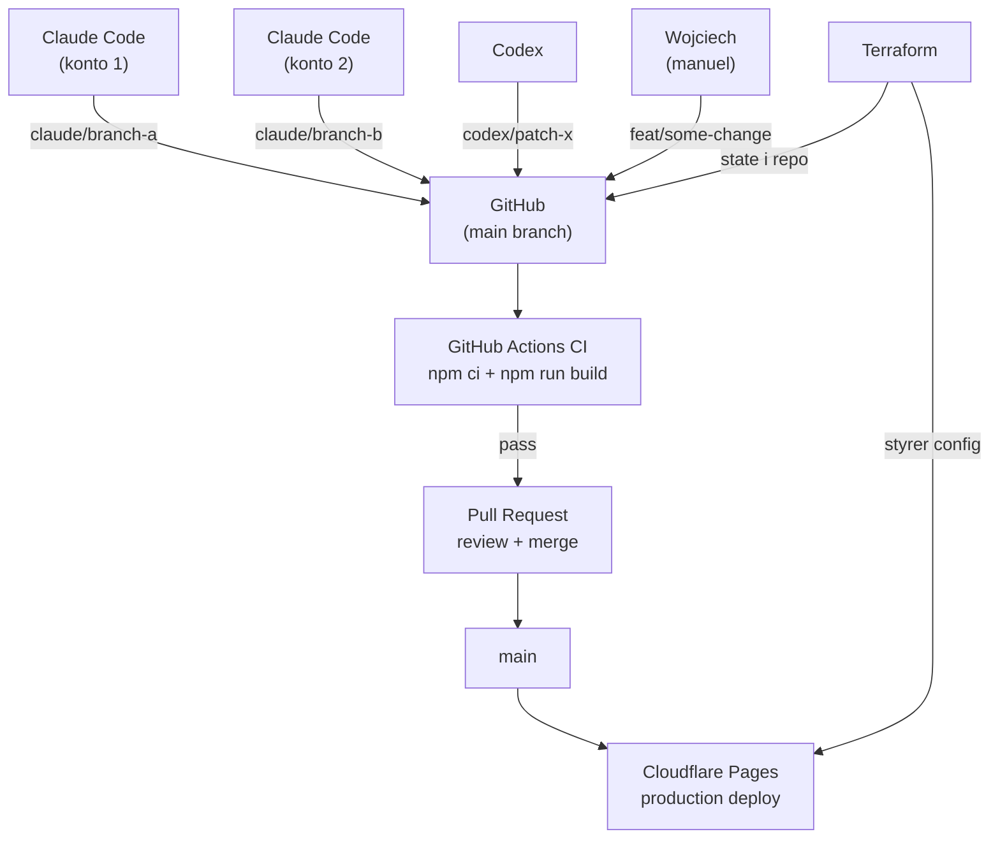

Dette er den ledsagende casestudie til [The Claude Code GTM Agent Starter Pack](/insights/how-to-build-gtm-ai-agent-outbound-crm/). Den foerste artikel beskriver en GTM agent stack. Denne beskriver, hvordan selve portfolio-systemet blev genopbygget.

Den offentlige side er [wojciech.io](https://wojciech.io/). App-overfladen er [app.wojciech.io](https://app.wojciech.io/). Maalet med genopbygningen var at faa begge dele til at foeles som dele af ét operativsystem: offentlig positionering, leveret dokumentation, apps, CV, skrivning, kontakt og fremtidige casestudier.

Resultatet var ikke en one-prompt-hjemmeside. Det var en struktureret build-proces med AI agents, kode, review, deployment-checks og et meget menneskeligt smagslag.

---

## Hvorfor genopbygge det

Portfoliet har vaeret gennem flere teknologi-epoker. For aar siden la det taettere paa WordPress-verdenen: fleksibelt nok til at publicere, men tungere end noedvendigt for en personlig arbejdsoverflade. Senere skiftede jeg til Framer, hvilket gav mening, da prioriteten var visuel hastighed, finish og hurtig iteration.

Denne genopbygning var naeste skridt: fra en visuel website-builder til et code-first, agent-assisteret system paa Cloudflare Pages.

Den tidligere Framer-version var nyttig, men systemet var vokset fra den.

Den nye version skulle kunne mere end at praesentere en bio:

<TwoUp
  left={{ title: 'Foer (Framer-aera)', items: ['Visuel builder, hurtig iteration', 'Ingen versionering, ingen Git-historik', 'Begraenset MDX, ingen content collections', 'Én overflade, svaer at udvide'] }}
  right={{ title: 'Efter (Astro + CF)', items: ['Code-first, agent-redigerbar', 'Fuld Git-historik, branch previews', 'MDX artikler, 44 custom components', 'Syv overflader, ét operativsystem'] }}
/>

Det primaere skift var fra "hjemmeside som en side" til "portfolio som en arbejdsoverflade."

---

## Min rolle i processen

Den vigtigste rolle i dette build var ikke Claude Code eller Codex. Det var det menneskelige beslutningsloop.

Mit job var at:

- definere, hvad sitet skulle blive;
- beslutte, hvilket legacy-indhold der skulle beholdes, omskrives, omdirigeres eller droppes;
- saette den visuelle retning;
- holde systemet taet paa app-portfoliet;
- afvise generisk AI-output;
- beslutte, hvilken dokumentation der var staerk nok til at publicere;
- gennemgaa screenshots og paapege, naar en sektion foeltes forkert;
- godkende den endelige deployment-retning.

Agenterne accelererede arbejdet, men de ejede ikke smagen.

Den skelnen er vigtig. Agentiske builds bevaeger sig hurtigt, men hastighed hjaelper kun, hvis nogen holder retningen stram.

---

## Hvorfor kode i stedet for Framer

Framer er staerk, naar prioriteten er visuel komposition og hurtig publicering. For dette projekt aendrede prioriteten sig.

Jeg havde brug for:

- versioneret indhold;
- MDX artikler;
- genbrugelige components;
- forudsigelige redirects;
- sitemap, RSS, robots, kanoniske URL'er og artikel-schema;
- Git-historik;
- gentagelige builds;
- deploy-verificering;
- et design system, der kan patches af agents uden at starte forfra.

Paa det tidspunkt blev en codebase det bedre control plane.

---

## Hvorfor Cloudflare i stedet for Vercel

Det var ikke en anti-Vercel-beslutning. Vercel er en staerk platform, saerligt for Next.js-produkter og server-renderede applikationer.

For dette projekt passede Cloudflare Pages bedre:

- den offentlige side er primaert statisk;
- Astro producerer et simpelt build-artefakt;
- DNS og custom domain-haandtering var allerede del af launch-arbejdet;
- HTTPS, edge hosting, redirects og domain-verificering kunne ligge taet sammen;
- Cloudflare Web Analytics gav nok synlighed uden at tilfoeje en tungere analytics-stack;
- app-overfladen havde ogsaa brug for simpel custom domain-verificering.

Beslutningen var pragmatisk: brug den platform, der matcher sitets form.

<Callout type="tip" title="Konsolideringsargumentet">
Naar DNS, CDN, WAF, hosting og deploy-verificering er paa samme platform, er driftsfladen ét dashboard og én API. Den fulde [security og identity stack paa Cloudflare](/insights/cloudflare-migration-zero-trust-free-tier/) har jeg beskrevet separat.
</Callout>

---

## Stacken

Den endelige stack er bevidst simpel:

```text
Astro                       : framework
Tailwind CSS                : styling og design tokens
MDX Content Collections     : artikler og struktureret indhold
GitHub                      : source of truth, CI, CODEOWNERS
GitHub Actions              : build-validering ved hvert push og PR
Cloudflare Pages            : hosting, branch previews, custom domain
Cloudflare DNS              : DNS, HTTPS, edge performance
Cloudflare Web Analytics    : lightweight analytics
Terraform (CF Provider v4)  : infrastructure as code for al CF config
Playwright                  : browser-level verificering efter deploy
Claude Code                 : store implementeringsbatches, agent sessions
Codex                       : fokuserede patches, QA, konfliktloesning
```

Astro haandterer den offentlige side og artikelsystemet. Tailwind og design tokens haandterer UI-systemet. GitHub er source of truth. Cloudflare Pages serverer produktion. Playwright tjekker, hvad browseren rent faktisk renderer.

Terraform styrer Cloudflare-konfigurationen: Pages-projektindstillinger, branch deploy-regler, custom domain. Det er det lag, der er nemt at springe over i et soloprojekt og dyrt at rekonstruere senere.

AI-vaerktoejerne er del af workflowet, ikke arkitekturen selv.

---

## Hvordan arbejdet blev fordelt

Den reneste opdeling var efter rolle, ikke efter tool-popularitet.

<Tabs labels={['Claude Code', 'Codex', 'Human Review']}>
  <Fragment slot="0">Stoerre implementeringsbatches: fundamenter, sidestrukturer, components, content-migrering, artikelskabeloner, bred sideimplementering. Fungerede bedst, naar opgaven havde klar dokumentation og afgraenset scope.</Fragment>
  <Fragment slot="1">Engineering-iteration: laese den aktuelle repo-tilstand, lave fokuserede patches, loese konflikter, koere builds, tjekke UI med browser-automation, verificere produktion efter deployment, stramme detaljer efter screenshot-review.</Fragment>
  <Fragment slot="2">Beslutte om UI'en foeltes rigtigt, om teksten loed som mig, om en sektion var for stor eller for generisk, og om systemet var klar til at publicere. Agenterne producerede og justerede. Jeg styrede og godkendte.</Fragment>
</Tabs>

---

## Multi-agent-koordinering

Projektet koerte med flere agents samtidigt: Claude Code paa to separate konti, Codex og lejlighedsvise manuelle commits. Den kombination introducerede et koordineringsproblem, som et single-developer-workflow ikke har.

Loesningen var et koordineringslag bygget af tre komponenter:

### Branch-navngivning efter kilde

Hver agent skriver til sin egen branch, aldrig direkte til `main`.

```text
claude/serene-joliot-904970   ← Claude Code (auto-genereret, fra begge konti)
codex/fix-footer-links        ← Codex (kort beskrivelsesprefix)
feat/work-page-redesign       ← manuelle commits fra Wojciech
```

Claude Code opretter worktrees automatisk. Codex er konfigureret til at bruge `codex/`-prefix. Det goer kilden til enhver aendring synlig i branch-listen uden at inspicere commits.

### Hvordan agenterne interagerer uden konflikter

Noeglen: aldrig to agents paa samme branch samtidigt.

I praksis:
- Claude Code aabner en worktree paa en ny branch, fuldforer en batch, opretter en PR.
- Codex arbejder paa en separat branch for QA, patches eller fokuserede aendringer.
- Hvis begge sessions roerte den samme fil, loeser den anden merge konflikten i PR'en: ikke lokalt og ikke interaktivt.



### Hvad der holder det rent mellem sessions

- Hver session slutter med en merget eller lukket branch. Ingen langtlevende feature-branches.
- Efter merge fjernes worktreen lokalt: `git worktree remove`.
- `terraform plan` efter enhver CF dashboard-aendring viser drift, foer det bliver et problem.

---

## Infrastruktur-lag

Cloudflare Pages-konfigurationen styres udelukkende af Terraform, ikke dashboardet.

Det er vigtigt af et par grunde, der foerst bliver tydelige efter foerste gang dashboard-indstillinger afviger fra det, man troede var konfigureret.

Terraform-konfigurationen daekker:

```hcl
resource "cloudflare_pages_project" "wojciech_io" {
  name              = "wojciech-io"
  production_branch = "main"

  source {
    config {
      preview_deployment_setting = "custom"
      preview_branch_includes    = ["claude/**"]  # kun agent-branches faar previews
    }
  }

  deployment_configs {
    production {
      environment_variables = {
        PUBLIC_CF_BEACON_TOKEN = "..."
      }
      compatibility_date = "2026-05-10"
      usage_model        = "standard"
      fail_open          = true
    }
  }
}

resource "cloudflare_pages_domain" "wojciech_io_custom" {
  domain = "wojciech.io"
}
```

Moensteret er:

```text
terraform plan    ← viser hvad der ville aendre sig
terraform apply   ← anvender det
git commit        ← config-aendringen er nu i versionshistorikken
```

Hvis CF-dashboardet drifter: via et manuelt klik, en CF-platformopdatering eller en uforsigtig aendring: viser `terraform plan` forskellen, foer den bliver usynlig. Staten er committet i repoen. Konfigurationen kan reviewes i en PR.

Et konkret fix dette fangede: efter det foerste apply nedgraderede Cloudflares API lydloest `usage_model` fra `standard` til `bundled`, nulstillede `compatibility_date` til `2024-01-01` og skiftede `fail_open` til `false`. Uden Terraform ville de aendringer have vaeret usynlige. Med det viste `terraform plan` driften, og `terraform apply` gendannede den korrekte tilstand paa to sekunder.

---

## Internationalisering som systembeslutning

Sitet leveres paa tre sprog: engelsk, polsk og italiensk. Implementeringsbeslutningen var bevidst og vaerd at dokumentere som en systembeslutning: ikke bare en UI-feature.

**URL vs. localStorage-problemet.** At gemme det aktive sprog i `localStorage` er hurtigt at implementere, men oedelaegger deling. Hvis en bruger saetter sproget til polsk og deler et link, ser modtageren det, der staar i deres `localStorage`: sandsynligvis engelsk. URL-baseret routing loeser dette: `/pl/` og `/it/` er rigtige ruter, delbare og indekserbare. Det er vigtigt for SEO og for link-deling via kanaler, hvor man ikke kan kontrollere modtagerens browser-tilstand.

**Hvordan implementeringen fungerer.** I stedet for fuld Astro i18n med `defineConfig` er hver sprogvariant en tynd statisk wrapper-side: `/pl/index.astro`, `/it/index.astro`, der hver importerer samme Layout og components. Paa component-niveau gemmes oversaettelige strings som `data-en`, `data-pl` og `data-it` attributter paa HTML-elementer. En lille `setLang()`-funktion laeser det aktive sprog fra URL-stien og bytter derefter `textContent` paa hvert attributeret element. Ingen framework-routing, ingen virtual DOM-re-render: bare en maalrettet attribut-scanning ved sideindlaesning.

**Hvorfor ikke `defineConfig` i18n.** For en personlig side med fem til ti sider ville det at omstrukturere indholdsmappen i locale-undermapper (`/en/`, `/pl/`, `/it/`) skabe mere overhead end det loeser. Tynde wrapper-sider er nemmere at vedligeholde og kraever ingen Astro-versionsbegransninger. Tradeoff: denne tilgang skalerer ikke rent forbi femten eller tyve sider.

**`initialLang` og `define:vars`.** Layout-componenten accepterer et `initialLang`-prop. Det injiceres via Astros `define:vars`-direktiv, saa URL-detekteret sprog har prioritet over enhver `localStorage`-vaerdi. Det forhindrer flash-of-wrong-language ved foerste indlaesning af en lokaliseret URL.

**SEO.** Hver sprogvariant inkluderer `<link rel="alternate" hreflang="...">` tags, der peger paa de kanoniske URL'er for alle tre sprog. Det er minimum for at Google korrekt kan associere sprogvarianter.

**Stoerrelses-tradeoff.** Alle tre sprog-strings er indlejret i HTML'en paa hver side. For landing pages er det acceptabelt: overhead er lille og deployment er simplere. For en indholdsplatform med hundredvis af artikler ville det ikke vaere den rette arkitektur.

---

## Sikkerhed og processhaerdning

Agentiske builds introducerer angrebsflade, som solo-builds ikke har. Flere agents, flere konti og automatiserede pushes betyder, at repositoriet kraever eksplicitte proceskontroller.

### Hvad der blev sat op

**CODEOWNERS**

```
* @wojciechluszczynski
```

Alle filer i repoen ejes af én person. GitHub dirigerer PR review-anmodninger derefter. Simpelt, men det betyder, at intet merges til `main`, uden at ejeren er i loopet.

**CI ved hvert push og PR**

```yaml
on:
  push:
    branches: ["main", "claude/**"]
  pull_request:
    branches: ["main"]
```

Hvert agent-push udloeser et build. Hvis Claude Code eller Codex producerer et oedelagt Astro-build, fanger CI det, foer PR'en kan gaa videre. Build-artefaktet fra `main`-merges gemmes i syv dage.

**Branch protection**

Branch protection paa private GitHub-repos kraever GitHub Pro. Alternativet var en navnekonvention haandhaevet af vane: agents bruger deres prefix, mennesker bruger `feat/` eller `fix/`. Det er godt nok for et projekt med én menneskelig beslutningstager. Hvis repoen nogensinde bliver offentlig, eller teamet vokser, bliver branch protection vaerd prisen.

**AI crawler-adgang**

Cloudflares "Block AI bots"-indstilling injicerer, hvis aktiveret, `Disallow`-regler for ClaudeBot, GPTBot, Google-Extended og andre i en syntetisk robots.txt. Den indstilling var aktiv og blokerede lydloest AI-indeksering.

Fixet var at deaktivere den og skifte til "Content Signals Policy": som respekterer `robots.txt` i repoen i stedet for at overskrive den. Repoens `robots.txt` tillader eksplicit alle crawlere.

Den ene indstilling var grunden til, at sitet ikke var synligt i AI-assistent-soegeresultater, selvom det rangerede fint paa Google.

<Callout type="warning" title="CF dashboard-faelde">
Cloudflares "Block AI bots" er slaaet til som standard for mange konti. Den injicerer lydloest Disallow-regler, der draeber AI-indeksering. Skift til "Content Signals Policy" og styr adgangen via din egen robots.txt.
</Callout>

---

## Sprint-modellen

Arbejdet koerte i batches.

<Steps items={[
  { title: "Sprint 0: Audit og retning", body: "Inventar af den gamle side, migreringsbeslutninger, hvad der pensioneres, hvad den nye side skal bevise." },
  { title: "Sprint 1: Fundament", body: "Astro, Tailwind, tokens, layouts, metadata, content collections, genbrugelige components." },
  { title: "Sprint 2: Kernesider og dokumentation", body: "Forside, work, AI systems, about, proof cards, testimonials, app-links. Fra skelet til narrativ." },
  { title: "Sprint 3: Indhold og lancering", body: "Artikelsystem, redirects, RSS, sitemap, robots, struktureret metadata, lanceringstjek." },
  { title: "Sprint 4: Post-launch-haerdning", body: "App-overflade, CV, stack, tidslinje, kontakt, toggles, footer, light/dark mode, visuel konsistens." },
]} />

Det sidste sprint betod noget, fordi det er her, en hjemmeside bliver et system i stedet for en samling sider.

---

## Deployment og verificering

Deployment-flowet er bevidst kedeligt:

```text
build
commit
push
deploy
verificer produktion
```

Verificeringstrinnet er den vigtige del.

Efter deployment inkluderer tjek:

- returnerer custom domain det nye build?
- returnerer siden `200`?
- er de forventede artikel- og UI-markoerer til stede?
- lister `/insights/` de rigtige posts?
- inkluderer RSS den nye artikel?
- renderer desktop og mobil uden horisontal overflow?
- opfoerer theme toggle sig korrekt?
- viser kontaktflowet den tilsigtede tilstand?

Et deploy preview er nyttigt. Custom domain er sandheden.

---

## Test-model

Test kombinerede tre lag.

### Build-checks

`npm run build` validerer Astro-sitet, content collections, MDX, routes, RSS, sitemap og statisk output.

### Browser-checks

Playwright verificerer, hvad der rent faktisk renderes:

- desktop-layout;
- mobil-layout;
- artikelsider;
- insights-listing;
- footer og navigation;
- light/dark toggle;
- kontakttilstand;
- overflow.

### Manuel review

Manuel review fanger, hvad automatiserede checks ikke kan:

- visuel hierarki;
- tone;
- rytme;
- om en sektion foeles som det samme produkt;
- om siden bliver for generisk.

Den kombination fungerede bedre end at stole paa et enkelt tool.

---

## Hvad der aendrede sig

Genopbygningen producerede et vedligeholdeligt portfolio-system:

- [wojciech.io](https://wojciech.io/) er nu en code-first Astro-side paa Cloudflare Pages;
- [app.wojciech.io](https://app.wojciech.io/) er taettere alignet med den offentlige side;
- Insights er rigtige MDX-artikler med struktureret metadata, RSS, sitemap og kanoniske URL'er;
- infrastruktur-config (Pages-projekt, branch previews, domain, env vars) styres af Terraform og versionskontrolleres;
- CI koerer ved hvert push fra enhver agent: ingen oedelagte builds naar `main` uopdaget;
- CODEOWNERS dirigerer alle PR reviews til den rette person, uanset hvilken agent der aabnede PR'en;
- AI-crawlere kan tilgaa sitet: Cloudflare dashboard-indstillingen, der blokerede dem, er deaktiveret;
- flere agents kan arbejde paa separate branches samtidigt uden at traede hinanden over taeerne;
- deployment er gentagelig og verificerbar paa custom domain-niveau.

Den reelle vaerdi er ikke, at AI lavede en hjemmeside.

Den reelle vaerdi er, at sitet nu har en workflow bag sig: og workflowet er ogsaa versionskontrolleret.

---

## Hvad jeg ville genbruge

Moensteret er simpelt:

1. Start med produktmaalet, ikke toolet.
2. Hold mennesket ansvarligt for smag, scope og godkendelse.
3. Giv Claude Code store implementeringsbatches.
4. Giv Codex review, QA, patching og deployment-verificering.
5. Brug screenshots, ikke meninger, til at afgoere UI-spoergsmaal.
6. Behold produktionsverificering som del af workflowet.
7. Tilfoej Terraform fra dag ét. Dashboard-config er usynlig drift, der venter paa at ske.
8. Brug branch-navnekonventioner til at goere agent-forfatterskab laesbart med ét blik.
9. Slaa CI til, foer du tilfojer den anden agent. Et oedelagt build fra en automatiseret session er svaerere at fange end ét fra et menneske.
10. Tjek crawler-adgang eksplicit. Cloudflares "Block AI bots"-toggle i dashboardet er slaaet til som standard for mange konti og deaktiverer lydloest AI-indeksering.
11. Fjern unoedvendige bevaegelige dele i stedet for at tilfoeje infrastruktur for dens egen skyld.

Agentisk bygning fjerner ikke doemmeraft.

Det goer doemmeraft vigtigere: og proceshygiejne taeller mere, ikke mindre, naar agents pusher til dit repo.

---

**Relateret:** [How to Build Micro-SaaS with AI Tools: product lessons from 10+ shipped apps](/insights/how-to-build-micro-saas-with-ai-tools) · [How to Build a GTM AI Agent for Outbound Research and CRM Enrichment](/insights/how-to-build-gtm-ai-agent-outbound-crm)
