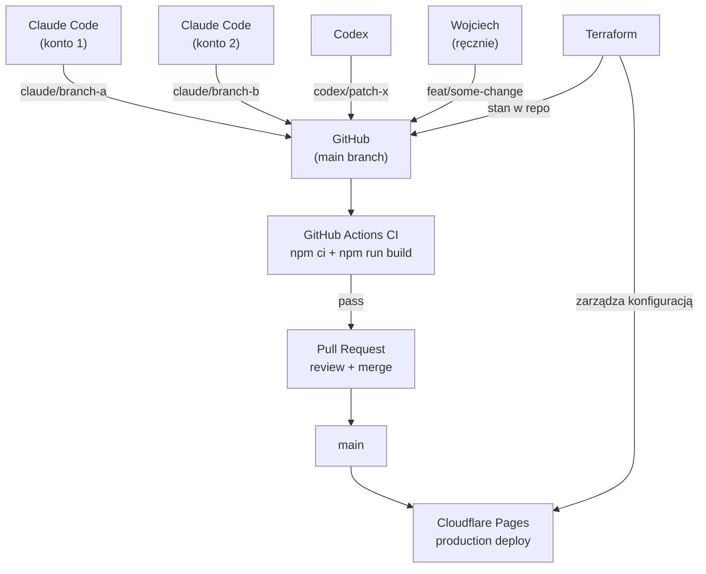

Ten artykuł to towarzyszące case study do [The Claude Code GTM Agent Starter Pack](/insights/how-to-build-gtm-ai-agent-outbound-crm/). Tamten tekst rozkłada na czynniki pierwsze stos GTM agenta. Ten opisuje, jak przebudowany został sam system portfolio.

Publiczna strona to [wojciech.io](https://wojciech.io/). Powierzchnia portfolio w stylu aplikacji to [app.wojciech.io](https://app.wojciech.io/). Celem przebudowy było sprawienie, żeby obie wyglądały jak części jednego systemu operacyjnego: publiczne pozycjonowanie, wysłane dowody, aplikacje, CV, teksty, kontakt i przyszłe case studies.

Wynik to nie strona zbudowana z jednego prompta. To ustrukturyzowany proces z agentami AI, kodem, recenzjami, weryfikacją deploymentu i bardzo ludzką warstwą gustu.

---

## Dlaczego przebudować

Portfolio przechodziło przez kilka technologicznych epok. Lata temu żyło bliżej świata WordPressa: elastyczne do publikowania, ale cięższe niż potrzeba dla osobistej powierzchni operacyjnej. Później przeszedłem na Framera, co miało sens, gdy priorytetem była szybkość wizualna, dopracowanie i szybka iteracja.

Ta przebudowa była kolejnym krokiem: z wizualnego kreatora stron do systemu code-first, wspomaganego przez agentów, na Cloudflare Pages.

Poprzednia wersja z ery Framera była użyteczna, ale system ją przerósł.

Nowa wersja musiała robić więcej niż prezentować biogram:

- pokazywać dowody przez wysłane projekty, nie ogólne usługi;
- łączyć stronę publiczną z portfolio aplikacji;
- obsługiwać długie artykuły techniczne;
- wersjonować przyszłe zmiany treści i UI;
- ułatwiać rozumowanie o deploymencie i DNS;
- utrzymywać spójny język designu między `wojciech.io` a `app.wojciech.io`;
- dać agentom codebase, w którym mogą bezpiecznie pracować;
- zwiększyć potencjał strony w czasie: artykuły, obiekty dowodowe, linki do aplikacji, eksperymenty i iteracja wspomagana przez agenty.

Główna zmiana: z "strony jako strony" na "portfolio jako powierzchnię operacyjną".

---

## Moja rola w procesie

Najważniejsza rola w tej budowie to nie Claude Code ani Codex. To ludzka pętla decyzyjna.

Moja praca polegała na:

- definiowaniu, czym strona ma się stać;
- decydowaniu, które legacy content zachować, przepisać, przekierować lub usunąć;
- wyznaczaniu kierunku wizualnego;
- trzymaniu systemu blisko portfolio w stylu aplikacji;
- odrzucaniu generycznego outputu AI;
- decydowaniu, które dowody są wystarczająco mocne do publikacji;
- przeglądaniu screenshotów i sygnalizowaniu, kiedy sekcja wyglądała nie tak;
- zatwierdzaniu ostatecznego kierunku deploymentu.

Agenty przyspieszyły pracę, ale nie miały władzy nad gustem.

Ta różnica ma znaczenie. Budowy agentyčne idą szybko, ale szybkość pomaga tylko wtedy, gdy ktoś utrzymuje kierunek w ryzach.

---

## Dlaczego kod zamiast Framera

Framer jest mocny, gdy priorytetem jest kompozycja wizualna i szybkie publikowanie. Dla tego projektu priorytety się zmieniły.

Potrzebowałem:

- wersjonowanej treści;
- artykułów MDX;
- wielokrotnego użytku komponentów;
- przewidywalnych przekierowań;
- sitemapy, RSS, robots, kanonicznych URL-i i schematu artykułów;
- historii Git;
- powtarzalnych buildów;
- weryfikacji deploymentu;
- systemu designu, który agenty mogą łatać bez zaczynania od nowa.

W tym punkcie codebase stał się lepszym płaszczyzna kontrolną.

---

## Dlaczego Cloudflare zamiast Vercel

To nie była decyzja anty-Vercel. Vercel to mocna platforma, szczególnie dla produktów Next.js i aplikacji renderowanych server-side.

Dla tego projektu Cloudflare Pages pasowało lepiej:

- strona publiczna jest w większości statyczna;
- Astro produkuje prosty artefakt builda;
- DNS i obsługa własnych domen były już częścią pracy przy starcie;
- HTTPS, edge hosting, przekierowania i weryfikacja domeny mogły żyć blisko siebie;
- Cloudflare Web Analytics dał wystarczającą widoczność bez dodawania cięższego stosu analitycznego;
- powierzchnia portfolio w stylu aplikacji też potrzebowała prostej weryfikacji własnej domeny.

Decyzja była pragmatyczna: użyj platformy, która pasuje do kształtu strony.

W tym przypadku oznaczało to Cloudflare Pages.

---

## Stos

Finalny stos jest celowo prosty:

```text
Astro                       : framework
Tailwind CSS                : stylowanie i tokeny designu
MDX content collections     : artykuły i ustrukturyzowana treść
GitHub                      : źródło prawdy, CI, CODEOWNERS
GitHub Actions              : walidacja buildu przy każdym push i PR
Cloudflare Pages            : hosting, branch previews, własna domena
Cloudflare DNS              : DNS, HTTPS, wydajność edge
Cloudflare Web Analytics    : lekka analityka
Terraform (CF provider v4)  : infrastruktura jako kod dla całej konfiguracji CF
Playwright                  : weryfikacja na poziomie przeglądarki po deploymencie
Claude Code                 : duże partie implementacji, sesje agentowe
Codex                       : skoncentrowane łatki, QA, rozwiązywanie konfliktów
```

Astro obsługuje stronę publiczną i system artykułów. Tailwind i tokeny designu obsługują system UI. GitHub jest źródłem prawdy. Cloudflare Pages serwuje produkcję. Playwright sprawdza, co przeglądarka faktycznie renderuje.

Terraform zarządza konfiguracją Cloudflare: ustawieniami projektu Pages, regułami deploymentu branchy, własną domeną. To warstwa, którą łatwo pominąć w projekcie solo i drogo odtworzyć później.

Narzędzia AI są częścią workflow, nie samej architektury.

---

## Jak praca była podzielona

Najczystszy podział był według roli, nie według popularności narzędzia.

### Claude Code

Claude Code był użyteczny przy większych partiach implementacji:

- fundamenty;
- struktury stron;
- komponenty;
- migracja treści;
- szablony artykułów;
- szeroka implementacja stron.

Działał najlepiej, gdy zadanie miało jasną dokumentację i ograniczony zakres.

### Codex

Codex był użyteczny przy iteracji inżynierskiej:

- czytaniu aktualnego stanu repo;
- robieniu skoncentrowanych łatek;
- rozwiązywaniu konfliktów;
- uruchamianiu buildów;
- sprawdzaniu UI z automatyzacją przeglądarki;
- weryfikacji produkcji po deploymencie;
- doprecyzowaniu szczegółów po przeglądzie screenshotów.

Działał najlepiej jako pragmatyczna pętla inżynierska.

### Ludzka recenzja

Moja rola polegała na decydowaniu:

- czy UI wygląda jak powinno;
- czy copy brzmi jak ja;
- czy sekcja jest zbyt duża, zbyt generyczna lub zbyt oderwana od reszty;
- czy system jest gotowy do publikacji.

Agenty produkowały i dostosowywały. Ja kierowałem i akceptowałem.

---

## Koordynacja wielu agentów

Projekt działał z wieloma agentami pracującymi równocześnie: Claude Code na dwóch osobnych kontach, Codex i sporadyczne ręczne commity. Ta kombinacja wprowadza problem koordynacji, którego nie ma workflow jednego dewelopera.

Rozwiązaniem była warstwa koordynacji zbudowana z trzech elementów:

### Nazewnictwo branchy według źródła

Każdy agent pisze na swój własny branch, nigdy bezpośrednio do `main`.

```text
claude/serene-joliot-904970   ← Claude Code (auto-generated, z dowolnego konta)
codex/fix-footer-links        ← Codex (prefiks z krótkim opisem)
feat/work-page-redesign       ← ręczne commity od Wojciecha
```

Claude Code tworzy worktrees automatycznie. Codex jest skonfigurowany do używania prefiksu `codex/`. Dzięki temu źródło każdej zmiany jest widoczne na liście branchy bez wchodzenia w commity.

### Jak agenty wchodzą w interakcję bez konfliktu

Kluczowa zasada: nigdy dwóch agentów na tym samym branchu jednocześnie.

W praktyce:
- Claude Code otwiera worktree na nowym branchu, kończy partię, otwiera PR.
- Codex pracuje na osobnym branchu do QA, łatek lub skoncentrowanych zmian.
- Jeśli obie sesje dotknęły tego samego pliku, drugi merge rozwiązuje konflikt w PR: nie lokalnie i nie interaktywnie.



### Co utrzymuje porządek między sesjami

- Każda sesja kończy się zmergowanym lub zamkniętym branchem. Żadnych długo żyjących feature branchy.
- Po merge worktree jest usuwany lokalnie: `git worktree remove`.
- `terraform plan` po każdej zmianie w dashboardzie CF pokazuje dryft zanim stanie się problemem.

---

## Warstwa infrastruktury

Konfiguracja Cloudflare Pages jest zarządzana w całości przez Terraform, nie przez dashboard.

To ma znaczenie z kilku powodów, które stają się oczywiste dopiero po tym, gdy ustawienia dashboardu po raz pierwszy rozchodzą się z tym, co myślałeś, że masz skonfigurowane.

Konfiguracja Terraform obejmuje:

```hcl
resource "cloudflare_pages_project" "wojciech_io" {
  name              = "wojciech-io"
  production_branch = "main"

  source {
    config {
      preview_deployment_setting = "custom"
      preview_branch_includes    = ["claude/**"]  # tylko branche agentów dostają previews
    }
  }

  deployment_configs {
    production {
      environment_variables = {
        PUBLIC_CF_BEACON_TOKEN = "..."
      }
      compatibility_date = "2026-05-10"
      usage_model        = "standard"
      fail_open          = true
    }
  }
}

resource "cloudflare_pages_domain" "wojciech_io_custom" {
  domain = "wojciech.io"
}
```

Wzorzec wygląda tak:

```text
terraform plan    ← pokazuje co by się zmieniło
terraform apply   ← aplikuje zmiany
git commit        ← zmiana konfiguracji jest teraz w historii wersji
```

Jeśli dashboard CF dryfuje: przez ręczne kliknięcie, aktualizację platformy CF lub niedbałą zmianę: `terraform plan` pokazuje różnicę zanim stanie się niewidoczna. Stan jest zacommitowany w repo. Konfiguracja jest przeglądalna w PR.

Jedna konkretna rzecz, którą to wykryło: po pierwszym apply API Cloudflare po cichu zdegradowało `usage_model` z `standard` na `bundled`, zresetowało `compatibility_date` do `2024-01-01` i zmieniło `fail_open` na `false`. Bez Terraforma te zmiany byłyby niewidoczne. Z nim `terraform plan` pokazał dryft, a `terraform apply` przywrócił właściwy stan w dwie sekundy.

---

## Internacjonalizacja jako decyzja systemowa

Strona działa w trzech językach: angielskim, polskim i włoskim. Decyzja implementacyjna była świadoma i warta udokumentowania jako wybór systemowy: nie tylko feature UI.

**Problem URL vs localStorage.** Przechowywanie aktywnego języka w `localStorage` jest szybkie do implementacji, ale psuje udostępnianie. Jeśli użytkownik ustawi język na polski i udostępni link, odbiorca zobaczy to, co mówi jego `localStorage`: prawdopodobnie angielski. Routing oparty na URL rozwiązuje to: `/pl/` i `/it/` to prawdziwe ścieżki, które można udostępniać i indeksować. Ma to znaczenie dla SEO i udostępniania linków przez kanały, gdzie nie możesz kontrolować stanu przeglądarki odbiorcy.

**Jak działa implementacja.** Zamiast pełnego Astro i18n z `defineConfig`, każdy wariant językowy to cienko owinięta statyczna strona: `/pl/index.astro`, `/it/index.astro`, każda importująca ten sam Layout i komponenty. Na poziomie komponentów, tłumaczalne ciągi są przechowywane jako atrybuty `data-en`, `data-pl` i `data-it` na elementach HTML. Mała funkcja `setLang()` odczytuje aktywny język ze ścieżki URL, a następnie zamienia `textContent` na każdym opatrzonym atrybutem elemencie. Żadnego routingu frameworkowego, żadnego re-renderowania wirtualnego DOM: tylko ukierunkowane skanowanie atrybutów przy ładowaniu strony.

**Dlaczego nie `defineConfig` i18n.** Dla osobistej strony z pięcioma do dziesięcioma podstronami, restrukturyzacja katalogu treści na podfoldery lokalizacji (`/en/`, `/pl/`, `/it/`) stworzyłaby więcej narzutu niż rozwiązuje. Cienkie strony opakowujące są łatwiejsze w utrzymaniu i nie wymagają ograniczeń wersji Astro. Kompromis: to podejście nie skaluje się dobrze powyżej piętnastu lub dwudziestu stron.

**`initialLang` i `define:vars`.** Komponent Layout przyjmuje prop `initialLang`. Jest wstrzykiwany przez dyrektywę `define:vars` Astro, żeby język wykryty z URL miał priorytet nad wartością z `localStorage`. Zapobiega to błyskowi złego języka przy pierwszym załadowaniu zlokalizowanego URL.

**SEO.** Każdy wariant językowy zawiera tagi `<link rel="alternate" hreflang="...">` wskazujące na kanoniczne URL-e dla wszystkich trzech języków. To minimum wymagane, żeby Google poprawnie skojarzyło warianty językowe.

**Kompromis rozmiaru.** Ciągi wszystkich trzech języków są osadzone w HTML każdej strony. Dla landing pages jest to akceptowalne: narzut jest mały, a deployment prostszy. Dla platformy treści z setkami artykułów nie byłaby to właściwa architektura.

---

## Bezpieczeństwo i utwardzanie procesu

Budowy agentyczne wprowadzają powierzchnię ataku, której nie mają budowy solo. Wiele agentów, wiele kont i automatyczne pushe oznaczają, że repozytorium potrzebuje wyraźnych kontroli procesowych.

### Co zostało wdrożone

**CODEOWNERS**

```
* @wojciechluszczynski
```

Wszystkie pliki w repo są własności jednej osoby. GitHub kieruje prośby o recenzję PR odpowiednio. Proste, ale oznacza, że nic nie trafia do `main` bez wiedzy tego właściciela.

**CI na każdym push i PR**

```yaml
on:
  push:
    branches: ["main", "claude/**"]
  pull_request:
    branches: ["main"]
```

Każdy push agenta wyzwala build. Jeśli Claude Code lub Codex produkuje zepsutego Astro builda, CI wychwytuje to zanim PR może być procedowany. Artefakt builda z merge'ów do `main` jest przechowywany przez siedem dni.

**Ochrona branchy**

Ochrona branchy na prywatnych repozytoriach GitHub wymaga GitHub Pro. Alternatywą była konwencja nazewnictwa egzekwowana przez nawyk: agenty używają swoich prefiksów, ludzie używają `feat/` lub `fix/`. Dla projektu z jednym ludzkim decydentem to wystarczy. Jeśli repo kiedyś stanie się publiczne lub zespół urośnie, ochrona branchy staje się warta kosztów.

**Dostęp crawlerów AI**

Ustawienie Cloudflare "Block AI bots", jeśli włączone z dashboardu, wstrzykuje reguły `Disallow` dla ClaudeBot, GPTBot, Google-Extended i innych do syntetycznego robots.txt. To ustawienie było włączone i po cichu blokowało indeksowanie przez AI.

Rozwiązaniem było jego wyłączenie i przejście na "Content Signals Policy": które respektuje `robots.txt` w repo zamiast go nadpisywać. `robots.txt` repo wyraźnie zezwala wszystkim crawlerom.

To jedno ustawienie było powodem, dla którego strona nie była widoczna w wynikach wyszukiwania asystentów AI, mimo że dobrze się pozycjonowała w Google.

---

## Model sprintu

Praca działała w partiach.

### Sprint 0: Audyt i kierunek

Zdefiniowaliśmy inwentarz starej strony, co powinno być zmigrowane, co wycofane i co nowa strona musiała udowodnić.

### Sprint 1: Fundamenty

Pierwsze przejście budowy skupiło się na Astro, Tailwind, tokenach, layoutach, metadanych, kolekcjach treści i komponentach wielokrotnego użytku.

### Sprint 2: Główne strony i dowody

Strona przeszła ze szkieletu do właściwej narracji: strona główna, prace, systemy AI, o mnie, karty dowodów, testimoniale i linki do aplikacji.

### Sprint 3: Treść i launch

System artykułów, przekierowania, RSS, sitemap, robots, ustrukturyzowane metadane i weryfikacja przed startem złożyły się razem.

### Sprint 4: Utwardzanie po launchu

Po starcie praca przeniosła się na spójność: powierzchnia aplikacyjna, CV, stos, oś czasu, kontakt, przełączniki, stopka, tryb jasny/ciemny i spójność wizualna.

Ostatni sprint miał znaczenie, bo właśnie tutaj strona staje się systemem zamiast kolekcją stron.

---

## Deployment i weryfikacja

Flow deploymentu jest celowo nudny:

```text
build
commit
push
deploy
verify production
```

Krok weryfikacji to ta ważna część.

Po deploymencie sprawdzenia obejmują:

- czy własna domena zwraca nowy build?
- czy strona zwraca `200`?
- czy oczekiwane znaczniki artykułów i UI są obecne?
- czy `/insights/` listuje właściwe posty?
- czy RSS zawiera nowy artykuł?
- czy desktop i mobilny render nie mają poziomego overflow?
- czy przełącznik motywu działa poprawnie?
- czy formularz kontaktowy pokazuje zamierzony stan?

Deploy preview jest użyteczny. Własna domena jest prawdą.

---

## Model testowania

Testowanie łączyło trzy warstwy.

### Sprawdzenia builda

`npm run build` waliduje stronę Astro, kolekcje treści, MDX, trasy, RSS, sitemap i statyczny output.

### Sprawdzenia przeglądarki

Playwright weryfikuje, co faktycznie się renderuje:

- layout desktopowy;
- layout mobilny;
- strony artykułów;
- listing insights;
- stopka i nawigacja;
- przełącznik jasny/ciemny;
- stan kontaktu;
- overflow.

### Ręczna recenzja

Ręczna recenzja wychwytuje to, czego zautomatyzowane sprawdzenia nie łapią:

- hierarchia wizualna;
- ton;
- rytm;
- czy sekcja wygląda jak część tego samego produktu;
- czy strona staje się zbyt generyczna.

Ta kombinacja działała lepiej niż poleganie na jakimkolwiek pojedynczym narzędziu.

---

## Co się zmieniło

Przebudowa przyniosła utrzymywalny system portfolio:

- [wojciech.io](https://wojciech.io/) to teraz code-first strona Astro na Cloudflare Pages;
- [app.wojciech.io](https://app.wojciech.io/) jest bliżej wyrównane z stroną publiczną;
- Insights to prawdziwe artykuły MDX z ustrukturyzowanymi metadanymi, RSS, sitemap i kanonicznymi URL-ami;
- konfiguracja infrastruktury (projekt Pages, branch previews, domena, zmienne środowiskowe) jest zarządzana przez Terraform i wersjonowana;
- CI działa na każdym push od każdego agenta: żadne zepsute buildy nie trafiają do `main` niezauważone;
- CODEOWNERS kieruje wszystkie recenzje PR do właściwej osoby niezależnie od tego, który agent otworzył PR;
- crawlery AI mają dostęp do strony: ustawienie dashboardu Cloudflare, które je blokowało, jest wyłączone;
- wiele agentów może pracować na osobnych branchach równocześnie bez wzajemnego zakłócania;
- deployment jest powtarzalny i weryfikowalny na poziomie własnej domeny.

Prawdziwa wartość nie polega na tym, że AI zrobiło stronę.

Prawdziwa wartość polega na tym, że strona ma teraz workflow za sobą: i ten workflow jest też pod kontrolą wersji.

---

## Co bym powtórzył

Wzorzec jest prosty:

1. Zacznij od celu produktowego, nie od narzędzia.
2. Zachowaj człowieka jako odpowiedzialnego za gust, zakres i akceptacje.
3. Daj Claude Code duże partie implementacji.
4. Daj Codex recenzje, QA, łatkowanie i weryfikację deploymentu.
5. Używaj screenshotów, nie opinii, do rozwiązywania pytań UI.
6. Zachowaj weryfikację produkcji jako część workflow.
7. Dodaj Terraform od pierwszego dnia. Konfiguracja dashboardu to niewidoczny dryft czekający na ujawnienie.
8. Używaj konwencji nazewnictwa branchy, żeby autorstwo agenta było widoczne na pierwszy rzut oka.
9. Włącz CI zanim dodasz drugiego agenta. Zepsutego builda z automatycznej sesji trudniej wychwycić niż zepsuty build od człowieka.
10. Sprawdź dostęp crawlerów wyraźnie. Przełącznik "Block AI bots" w dashboardzie CF jest domyślnie włączony dla wielu kont i po cichu wyłącza indeksowanie przez AI.
11. Usuń niepotrzebne ruchome części zamiast dodawać infrastrukturę dla samej infrastruktury.

Budowanie agentyczne nie usuwa osądu.

Sprawia, że osąd jest ważniejszy: a higiena procesu ma większe, nie mniejsze znaczenie, gdy agenty pushują do twojego repo.

---

**Powiązane:** [Jak budować Micro-SaaS z narzędziami AI: lekcje produktowe z 10+ wysłanych aplikacji](/insights/how-to-build-micro-saas-with-ai-tools) · [Jak zbudować GTM AI Agent do badań outbound i wzbogacania CRM](/insights/how-to-build-gtm-ai-agent-outbound-crm)
